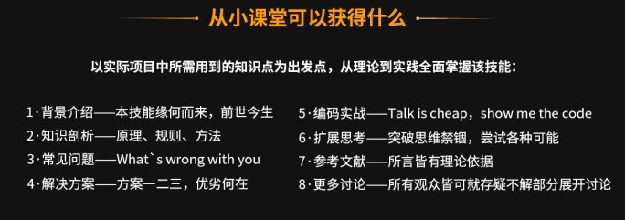

# 31~40

## 31、再次理解闭包？

测试代码如下：

``` js
var a = 1

function test() {
    var c = 1
    var b = 2
    return function test2() {
        console.log(b++)
    }    
   
}

var x = test()
x()
x()
x()
```

结果：


偶然看到小野老师解释闭包：

函数内部返回一个函数出去，其内部还带着一个变量出去，而这种函数就是闭包函数

如果咩有「一个函数携着一个变量出去」这种情况，那么一定不可能形成闭包

需要注意的是，闭包不是「是不是」的说法，而是「形不形成」的说法，总之，闭包是一种现象哈！因此我们一般不会去讨论这个是不是闭包，而是在什么条件下形成了闭包！

> 闭包给我的赶脚就像是CSS在某些条件下触发了BFC哈！
>
>关于「现象」这个词：事物在发展变化中表现出来的外部形态（跟「本质」相区别），如「打架斗殴的 现象时有发生」
>
>因此联系到闭包这种现象，那么就是在函数的执行过程当中表现出来的一种外部形态，如在 `Scope`里边多了一个叫 `Closure`的东东！

## 32、偶然对 `#app` 它的一个感性认识？

大众理解，`#app`在Vue里边就是一个挂载点哈！

而感性点理解就是：

`#app`给我的感觉就像是种树时圈个地，然后把构建好的组件树，直接种上去

## 33、关于事件捕获与冒泡的执行顺序？

``` html
<div id="div1">div1
  <div id="div2">div2
    <div id="div3">div3</div>
  </div>
</div>
```

``` css
#div1 {
  width: 300px;
  height: 300px;
  background-color: red;
}

#div2 {
  width: 200px;
  height: 200px;
  background-color: yellow;
}

#div3 {
  width: 100px;
  height: 100px;
  background-color: #12dada;
}
```

``` js
div1.addEventListener('click',function(e){
  alert('div1')
},true)

div2.addEventListener('click',function(e){
  alert('div2')
},true)

div3.addEventListener('click',function(e){
  alert('div3')
},false)
```

**➹：** <https://jsbin.com/fewihifuma/edit?html,css,js,output>

我点击div3，程序的执行是123，也就是捕获是大佬！冒泡是小弟，总之：

在假设点击孙子的情况下，

如果孙子是false，爷父都是true，那么会先执行爷，然后父，最后才是孙！

如果父是true，爷孙都是false，那么会先执行父，然后是孙，最后才是爷！

如果爷是true，父孙都是false，那么会先执行爷，然后是孙，最后才是父！

## 34、如何在基于Vue 的UI组件库进行二次开发？

> 公司最近要做框架移植，就是把我们自己框架的组件换成用VUE重构的组件，用vue 框架基于开源UI库二次开发，然后在自己的框架上引入使用，这个我应该从什么开始入手

 先捋清原有组件的逻辑与需求，需要支持什么样的具体业务，然后进行开发

## 35、什么叫hook？

问题缘由：

> The html-webpack-plugin provides **hooks** to extend it to your needs. There are already some really powerful plugins which can be integrated with zero configuration

这个「hooks」到底是啥意思？与此相关的还有React hooks

大白话：

> 从网上查阅资料时经常会遇到hook这个词，尤其是阅读源码的时候，感觉挺有意思的，百度翻译了一下是钩子的意思，当你如果还是一名学生的时候，word天呐，对说了这个词语的人真是崇拜至极，心里默念着牛逼，其实这是一名程序员应该懂的基本功。
> 
> 其实钩子来源于英文词Hook，在windows系统中，一切皆消息，比如按了一下键盘，也是一个消息，Hook的意思是勾住，也就是在消息过去之前，可以先把消息勾住，不让其传递，你可以优先处理，也即这项技术就是提供了一个入口，能够针对不同的消息或者API在执行前，先执行你的操作，你的操作也称为「钩子函数」。
> 
> 所以，有的时候程序员在讨论的时候，也经常会说，可以先hook住，在处理，也即在执行某某操作之前，优先处理一下
> 
> 好啦，这就是Hook的思想和原理，希望以后在和猿交流的过程中，听到这个词的时候，你能够自信的对程序员点点头

说白了，也就是在消息传递给真正的函数执行前，先用个钩子函数处理一下先！（可以简单理解为方法拦截处理，即钩子函数拦截消息，然后处理它，把处理之后的信息再传个大佬函数去处理！）

而React Hooks 的意思是，组件尽量写成纯函数，如果需要外部功能和副作用，就用钩子把外部代码"钩"进来。 React Hooks 就是那些钩子。

总之，你需要什么功能，就使用什么钩子，而所有的钩子都是为函数引入外部功能。


**➹：**[jantimon/html-webpack-plugin: Simplifies creation of HTML files to serve your webpack bundles](https://github.com/jantimon/html-webpack-plugin#events)

**➹：**[程序猿口中的Hook是什么意思？ - 简书](https://www.jianshu.com/p/0eeb3885b2e1)

**➹：**[React Hooks 入门教程 - 阮一峰的网络日志](https://www.ruanyifeng.com/blog/2019/09/react-hooks.html)

## 36、Beta版存在的意义？

Beta：

也是测试版，不过一般指公开或半公开测试版。这个阶段的版本可能还会一直加入新的功能。在 Alpha 版之后推出。现在很多软件直接就在 Beta 版上发布了，然后 Beta 一段时间就又变成下一个版本的 Beta 版，似乎就没有正式版了。估计一方面是因为现在各个软件都开始快速发布，来不及搞正式版了；另一方面，**以 Beta 测试版的名义发布，如果软件出了些纰漏，也可以推脱说是还在测试中吧。**


关于软件版本快速迭代的意义：

> 像Windows这类软件总是不断的推出新版本,比如Windows2.0,Windows3.0,这就意味着他们改进了产品,希望你购买更好的版本,换句话说,他们最开始卖给你的产品并不是完美的。虽然他们可能知道哪里有漏洞需要改进,但还是卖给了你。
> 
> 有些人错过了市场机遇,就是因为他们在不断地改进他们的产品。有些产品永远难以走向市场,就是因为它们一直都在被实验和完善当中。
> 
> 其实懂得将一种产品推向市场是一门艺术,也是一门科学。不要试图等着把产品做得完美,它永远都不会完美的。它只要能够 "足够好", 只要能被市场接受就没有问题。
> 
> Windows虽然带着那么多的蠕虫和缺陷,却大获成功。为什么会这样？ 
> 
> 因为它满足了市场需求,并且不比大家期望的差。微软发现了一扇开启的机会之窗,然后就开始营销。现在正在使用Windows的你们一定不会否认,如果微软等待产品完美了在推向市场,它就永远都不会在市场上出现。
> 
> 不过也要记住,如果一种产品差得根本无法满足其设计用途,或是无法达到市场的预期,甚至造成了麻烦,那么砸掉的牌子也很难再竖立起来。

**➹：**[为什么软件要发布 BETA 版，不直接发布正式版呢？ - 知乎](https://www.zhihu.com/question/20028437)

## 37、一种学习知识点的套路？



**➹：**[CSS 的 ID 和 Class 有什么区别？如何正确使用它们？ - 技能树IT修真院的回答 - 知乎](https://www.zhihu.com/question/19550864/answer/660405203)


## 38、关于看视频学习？

- 不要把老师的理解记下来
- 不要把不能改变自己的行为给记下来
- 别想着只看一遍
- 先实践后理解
- 记住要点
- 记住坑点
- 2个小时的视频，最多看6个小时，不完全理解也没啥关系（不理解的，再次回顾时用3倍速来看）

不管怎样，以用为主导，敲多了自然会理解！始终谨记把学到的东西用出来，如果是重视逻辑梳理的、便于我们理解其它东西都可以记下来，这也是有用的，只是没有体现在我们写代码做出什么效果而已！

> 时刻在想，这老师逼逼了一堆东西，到底想在告诉我们什么？
> 
> 多归纳一些最佳实践

其它人的看法：

A：

1. 先思考该技术的应用领域以及主要应用的场景，它是用来解决那些问题的。
2. 问自己，学习该技术后，就目前情况乃至延后几个月或者一年的时间我有多大的应用机率（太低，我就不建议花费太多时间去深入学习了，了解到一定程度可以了）
3. 入门，从官方文档开始，从官方提供的 example 实践
4. 关注该技术的牛人，为进阶做准备
5. 实践，技术只存在大脑是没有任何意义的，实实在在做一次该技术的开发才能发现自己那些东西忽略了，那些东西需要进一步的巩固，此时你需要一个好的笔记应用。

B：

> 代码即笔记，使劲地去敲！不断地敲，不断地去理解它！

C：

>不要刻意去做笔记，有时候觉得该做记号，就用记号笔划一下，记号笔我喜欢准备三只，一只红色代表非常重要、难点、困惑、勘误，一只淡绿代表，代表有启发、妙笔、妙方式，一只淡蓝色，代表总纲、纲要性、总结性。
>
>有时候看代码时要写下代码脉络，或者勘误文字，或者重要领悟，才用水笔写字。
>
>而电子版，规则同上。电子版的划线涂色也算方便，但是写注解是比较不方便的。
>
>我觉得运行书中代码、写课后习题、以及用前面所学知识自己实践一下总结一下体会一下则比做笔记更重要。

D：

>先粗略的看一遍，了解书里大概讲什么内容，然后确定要不要做笔记。
>
>然后搞清楚做笔记的目的是什么？
>
>做笔记的目的是帮助你梳理重点，内化知识。
>
>所以，我一般都用xmind来做笔记。
>
>可以参考我这篇文章：[Web Animation 学习记录](https://zhuanlan.zhihu.com/p/27456556)


**➹：**[各位学习新技术的方式是什么？博客、看书还是视频 - V2EX](https://www.v2ex.com/t/595244)

**➹：**[V2EX › visonme](https://www.v2ex.com/member/visonme)

**➹：**[Web Animation 学习记录 - 知乎](https://zhuanlan.zhihu.com/p/27456556)

**➹：**[看编程相关的书，怎么做笔记？ - 知乎](https://www.zhihu.com/question/48757999)

**➹：**[啥软件可以给课程视频添加多个时间点标记，用来标注这里讲的什么内容，复习的时候可以选择从标记点播放？ - 知乎](https://www.zhihu.com/question/29523392)

**➹：**[如何在看视频的时候做笔记？ - 知乎](https://www.zhihu.com/question/269641064)

## 39、在编程的时候，你会花多长的时间来思考？

**➹：**[在编程的时候，你会花多长的时间来思考？ - V2EX](https://www.v2ex.com/t/627839#reply42)

## 40、有哪些很烂的官方文档？

Get到了某个点：

> 开源社区的意思就是如果你觉得 Vue 的文档烂，你可以动手改，改完之后会有人感谢你的

**➹：**[Vue.js 官方中文文档写的很烂吗？ - 知乎](https://www.zhihu.com/question/61722492)

**➹：**[微信开发者文档存在哪些问题？ - 知乎](https://www.zhihu.com/question/29604939/answers/updated)