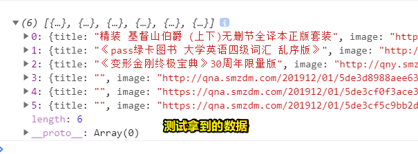

# 面向对象深度解析（2）

## ★TPR

**1）浅析 ES6 的 class？**

利用 ES6 提供的模块化，我们可以对 class 进行模块的导入和导出

目录结构：

由于需要写多个类，那么我们要新建个 `src/classess` 目录

接着，我们要写个模块，即写一个people类，那么就创建个 `people.js`，对于一些老程序员来说，他们会这样写 `people.class.js`，当然这是可以的，不过，我们的 `classes`目录名已经区分好了，即这个目录下的JS 文件，或者说是模块，都是一个个class哈！

ES5 的 「类」：

ES5用构造函数的方式去模拟一个类，但实际上 `function People() {}` 并不是一个类，那么为啥要这样说呢？——因为在ES6里边，构造函数实际上是class里边的一个函数啊！

搞一个 class 出来？

在ES6里边，引入了类的概念，我们要搞个类出来，那么我们就要用 `class` 关键字去声明一个类：`class People{}`，而这就是声明一个类的方式啦！

**2）浅析 class 的成员属性和成员方法？**

> 成员方法里边可以访问到这个class里边所有的方法和属性，而这需要通过 `this`点某个属性或方法来搞！

- 成员属性一般定义在构造函数里边

  类它有自己的构造函数，这个构造函数等价于我们ES5写的构造函数，不过在class里边，这构造函数叫 `constructor`

  而且，在class内部的函数统一都是用 `xxx(){}`的格式来写，即不用写上`function` 关键字了，如 `function xxx(){}` ，而这也就引出了类的成员方法，这成员方法的写法也是 `xxx(){}`这种格式的！

- 成员方法一般定义在 `class xxx {}`的 `{}`里边，即与构造函数并列，一般构造函数在 `{}` 的上边，而成员方法则在下边

话说，类的成员方法，和我们在ES5里边 `People.prototype.eat = function(){}` 有啥区别？

在class里边定义一个成员方法，不需要 `People.prototype.xxx` 这种姿势了，而是直接 `xxx(){}`，其结果，`xxx`
同样是挂载到 `prototype`旗下，而且`constructor`也是在 `prototype`旗下，对比ES5的，它们俩在JS 引擎里边呈现的效果，即new出来的实例，基本没有什么区别，只是它们俩在写法上，class要比ES5的姿势简洁很多！


**3）import一个模块的后缀？**

如果搞了工程化，即用到了构建工具，那么导入的模块文件是不需要加 `.js`的，毕竟一个模块就是一个js文件！

**4）ES5的构造函数，与 ES6 的 class，它们实例化一个对象会有区别吗？**

在写代码上，实例化一个对象，是完全一模一样的写法，但是实例化出来的对象的原型上是有点区别的，不过这点区别对我们开发者来说可忽略不计，即对我们写代码来说完全没有影响，说白了，就是之前怎么写的，那么现在还是怎么写的！


从log结果可以看到，`xiaoming`这个实例都是People这个构造函数构造出来的，而且成员属性也是一样的，不过它们的 `__proto__`就有点不一样了，一个是People这个class里边的构造函数，一个则是People这个构造函数。总之，它们俩一个是实例化一个真正的class出来的对象，一个则是实例化构造函数出来的对象！

总之，它们俩的实例化是有区别的！即一个实例化class，然后把参数传给它的`constructor`，另一个ES5姿势则是典型的从构造函数里边实例化！

总之，本质上它们俩是一样的，但过程有所不同！

总之，class姿势和ES5的function姿势，都是实例化的构造函数，只是class的构造函数来源于class里边的 `constructor`，而ES5则是直接的 `function`（你查看它们的constructor旗下的name属性就知道，即都叫 `People`，一个是`class`的名字 People，一个则是`function`的名字 People ）

总之，除了构造造函数的来源之外，它们俩在JS 引擎里边所呈现的效果几乎是一样的，即运行起来没有区别！

**5）使用class来面向对象的好处？**

相较于用ES5来模拟面向对象，ES6的class这种姿势显然看上去要标准一些，要简洁一些

ES6引入这个类的概念，其实这仅仅只是在写法上有所不同，真正在V8引擎里边运行JS 代码（class写法的面向对象代码和ES5构造函数写法的面向对象代码）没有区别，即new一个对象出来的效果都是一样的，当然，这可以简单理解为class就是语法糖哈！

JS 的类很简单，但我们需要了解的是从理论上去理解面向对象里边涉及到的理论知识，如三大特性——封装、继承、多态！

**6）关于类里边的成员方法里边的`this`指向？**

同ES5的构造函数一样，谁调用就指向谁，一般来说，指向的都是new出来的实例哈！

**7）parcel打包？**

由于需要import一个css模块，所以我用parcel打包了，而用了它之后，你之前在 `index.html` 里边写的 `<script type="module" src="……"></script>`里边的 `type`属性可以扔掉了！不然，会报错哈！

**8）ES5 -> ES6 面向对象大变革之「继承」篇？**

- 面向对象中的「继承」是其最重要的一个特性

- 继承：子类通过一种特定的形式去使用父类上的成员属性和方成员法（或者说是对象或实例的属性和方法）

- ES5：通过JS 对象原型与原型链的特性，实现对象与对象之间的继承关系。（原型链继承、call/apply继承、公共原型继承、圣杯模式继承）

- ES6：extends关键字继承，也是面向对象语言通用的继承操作的关键字

**9）C++的成员属性或方法？**

在C++里边属性和方法是有分类的，如实例的成员属性和方法、类的成员属性和方法，而在JS 里边是没有这样的分门别类的！毕竟JS 本身并不是纯面向对象的，实现的面向对象都是片面的，说白了，JS关于面向对象的实现并不完整！总之，在JS 里边我们可以通过new就可以使用class里边的成员属性和成员方法了！

**10）浅析ES5和ES6的继承方式？**

ES5是没有类这个概念的，既然没有类，那么我们就需要通过ES5已有的这些特性来实现对象之间的继承关系，而这种方式其实挺迂回的（曲折环绕的），如原型链继承等等

自打ES6引入了这个class概念之后，JS的继承就更加靠近面向对象语言了，即如C++、Java等语言，一提到继承，那就是一个 `extends` 关键字就完事了，说白了使用了这个关键字就实现了继承，不像在ES5里边那样，我们要封装一些有关继承的程序，然后才能实现对象与对象之间的继承关系！

总之，ES6的class特性增加了一个继承的功能，而这个功能是通过 `extends`这个关键字来实现子类与父类之间的继承关系！

**11）`super`这个关键字是干嘛的？**

举例来说，有个People类：

``` js
class People {
  constructor(name,height,weight,hobby){
    this.name = '名字:'+ name
    this.height = height
    this.weight = weight
  }
}
```

还有个子类——Student：

``` js
class Student {
  // sno：school No.,学号
  constructor(name,height,weight,sno){
    this.name = '名字:'+ name
    this.height = height
    this.weight = weight
  }
}
```

People的成员属性和Student的成员属性存在交集，那么这部分交集内容，可以让Student通过继承People类获得，如这样：

``` js
class Student extends People {
  constructor(name,height,weight,sno) {
    // super的参数没有hobby，那么是不会去继承父类的hobby的
    super(name,height,weight)
    // 等价于：
    // this.name = '名字'+name
    // this.height = height
    // this.weight = weight
    this.sno = sno
  }
}
```

总之，通过 `extends` 和 `super`这两个关键字，形式上让我们少写了很多代码！对了，当你把一个Student类当作是一个JS 文件，即一个模块的时候，别忘了要导入 People这个模块哈！

**12）原生的AJAX封装？**

``` js
/* 
*@desc 原生ajax封装
*/
var xhr = (function () {

  function _doAjax(opt) {
    var o = window.XMLHttpRequest ?
      new XMLHttpRequest() :
      new ActiveXObject('Microsoft.XMLHTTP'); //ie5、ie6使用

    if (!o) {
      throw new Error('您的浏览器不支持异步发起HTTP请求');
    }

    var opt = opt || {},
      type = (opt.type || 'GET').toUpperCase(),
      async = '' + opt.async === 'false' ? false : true,
      dataType = opt.dataType || 'JSON',
      jsonp = opt.jsonp || 'cb',
      jsonpCallback = opt.jsonpCallback || 'jQuery' + randomNum() + '_' + new Date().getTime();
      url = opt.url,
      data = opt.data || null,
      timeout = opt.timeout || 30000,
      error = opt.error || function () { },
      success = opt.success || function () { },
      complete = opt.complete || function () { },
      t = null;

    if (!url) {
      throw new Error('您没有填写URL');
    }

    if(dataType.toUpperCase() === 'JSONP' && type !== 'GET'){
      throw new Error('如果dataType为JSONP，type请您设置GET或不设置');
    }

    if(dataType.toUpperCase() === 'JSONP'){
      var oScript = document.createElement('script');
      oScript.src = url.indexOf('?') === -1  
                        ? url + '?' + jsonp + '=' + jsonpCallback
                        : url + '&' + jsonp + '=' + jsonpCallback;
      document.body.appendChild(oScript);
      document.body.removeChild(oScript);
      window[jsonpCallback] = function(data){
        success(data);
      };
      return;
    }

    o.onreadystatechange = function(){
      if(o.readyState === 4){
        if((o.status >= 200 && o.status < 300) || o.status === 304){
          switch(dataType.toUpperCase()){
            case 'JSON':
              success(JSON.parse(o.responseText)); 
              break;
            case 'TEXT':
              success(o.responseText);
              break;
            case 'XML':
              success(o.responseXML);
              break;
            default:
              success(JSON.parse(o.responseText)); 
          } 
        }else{
          error();
        }
        complete();
        clearTimeout(t);
        t = null;
        o = null;
      }
    }

    o.open(type, url, async);
    type === 'POST' && o.setRequestHeader('Content-type', 'application/x-www-form-urlencoded');
    o.send(type === 'GET' ? null : formatDatas(data));

    t = setTimeout(function(){
      o.abort();
      clearTimeout(t);
      t = null;
      o = null;
      throw new Error('本次请求已超时，API地址：' + url);     
    }, timeout);
  }

  function formatDatas(obj){
    var str = '';
    for(var key in obj){
      str += key + '=' + obj[key] + '&';
    }
    return str.replace(/&$/, '');
  }

  function randomNum(){
    var num = '';
    for(var i = 0; i < 20; i++){
      num += Math.floor(Math.random() * 10);
    }
    return num;
  }

  return {
    ajax: function(opt){
      _doAjax(opt);
    },

    post: function(url, data, dataType, successCB, errorCB, completeCB){
      _doAjax({
        type: 'POST',
        url: url,
        data: data,
        dataType: dataType,
        success: successCB,
        error: errorCB,
        complete: completeCB
      });
    },

    get: function(url, dataType, successCB, errorCB, completeCB){
      _doAjax({
        type: 'GET',
        url: url,
        dataType: dataType,
        success: successCB,
        error: errorCB,
        complete: completeCB
      })
    }
  }
})();
```

**13）本地mock数据？**

> 别忘了处理浏览器的同源策略：我在这里用了CORS「跨源资源分享」的方式来处理！


写await的时候，要在一个async函数里边写；使用 `JSON.stringify`的时候，要传满三个参数！

**➹：**[node.js - Proper way to return JSON using node or Express - Stack Overflow](https://stackoverflow.com/questions/19696240/proper-way-to-return-json-using-node-or-express)

**➹：**[javascript - await is only valid in async function - Stack Overflow](https://stackoverflow.com/questions/49432579/await-is-only-valid-in-async-function)

**➹：**[【JS】正则表达式获取url的各个部分](https://gist.github.com/simplelife7/3794444)


## ★用ES6姿势完成两个案例demo

> 请对比ES6姿势与ES5姿势的异同

**➹：**[添加 ES6 写法的 People类和Tab类 · ppambler/xdmala-demo@4b94fd3](https://github.com/ppambler/xdmala-demo/commit/4b94fd3fe1add3e9148430789c655b1702735efb)


以上的学习只是了解到了面向对象的基础，接下来还会学习到面向对象的三大特性，虽然这三大特性在JS 里边不一定用得上，但是还是需要得去了解一下的！


## ★继承

我们知道People是个大类，而在人类社会里边，根据社会分工来划分的话，有程序员、文员、学生等等

因此，我们就可以这样定义一个子类，如 `Student`类：

``` js
import { People } from "./People";

class Student extends People {
  constructor(name, height, weight, sno, subject) {
    super(name, height, weight)
    this.sno = sno
    this.subject = subject
  }

  study() {
    console.log(`我的学号是 ${this.sno}，我正在学习 ${this.subject}`)
  }
}

export { Student }
```

测试得到：


可见，`super`关键字 考量我们要继承哪些成员属性，而单纯只写一个 `super`是无法做到继承的，还得写上 `extends` 才行，至此，我们不单只继承了成员属性，还继承了成员方法，而效果，类似于实现了原型链的继承！

> 子类没有的成员方法，会到父类里边去找！谁叫我们子类继承了父类呢！

小结：关于这个继承，尤其是在JS 的面向对象里边，是必须要掌握的！

---

## ★在实际场景中用到class和继承

再举一个栗子（这是一个真实的关于类的使用场景）：

> 我们在做AJAX请求的时候，经常会封装一个AJAX类，然后还会封装一个其它的模型类，即Model类，然后这个Model类就会去调用这个AJAX类，然后就会把数据获取出来！

AJAX的类的封装如下：

> 在ES6里边，形参变量，与局部用let声明的变量是不能取同一个名字的！

**1）目录划分：**

1. 创建一个HTTP类：`src/utils/http.js`
2. 在封装这个AJAX类的时候，需要用到其它的工具函数，因此，就创建了 `src/utils/tools.js`
3. 由于要使用HTTP这个类，而且根据模型层的概念，那么就创建一个 `src/models/index.js`，index.html这个页面所需要的具体的模型数据要写到index.js里边，即发送ajax请求的代码是在这儿里边写的！
4. 创建 `src/utils/config.js`，用于配置请求的url前缀

**2）代码如下：**

**➹：**[通过封装个HTTP类来进一步了解继承 · ppambler/xdmala-demo@f37fb18](https://github.com/ppambler/xdmala-demo/commit/f37fb18081ea696430c83f3d2b53975588066af7)

**3）效果：**



数据来源：[【图书音像】价格_品牌_怎么样选购_什么牌子好_什么值得买](https://m.smzdm.com/fenlei/tushuyinxiang/)

小结：

我们在开发的时候，工具是个ajax，即HTTP类，然后模型则是继承自HTTP类，然后再模型层里边通过继承而来的ajax方法去请求数据，然后通过Promise再把数据给传出去！

以上就是一个典型的继承使用实例，不管学什么东西，不要简单的了解个People类、Student类就完事儿了，你得真真正正地深入到我们的开发当中去，然后从这个开发里边体现出这个继承的实用性！

继承很简单，就一个 `extends`关键字，但你也不要小看它，因为如何继承一个东西，是需要有经验才能做的，如如何在开发当中去设计自己的程序（如如何设计这种继承关系、如何设计这种类等等……都需要一定的开发经验，而这种经验的获取可以通过老师给出的代码实例来灌输，也可以自己去看他人的源码分析）


## ★总结

- 我们在写tab功能时，了解到用ES5的构造函数写业务逻辑，和用ES6的class写业务逻辑，并没有啥区别，完全就是赤裸裸的copy过来就可以了！

- 一种学习姿势：关于了解面向对象，在了解了ES5的基础上，然后再用class这种面向对象编程方式去写，你会发现你对class这种面向对象有了一种更清晰、更容易的认识！说白了，学习一个东西，先了解它的无糖，然后再去用它的有糖，这时你会发现，有糖的写法并咩有想象当中的那么难以理解了！如class这种写法


