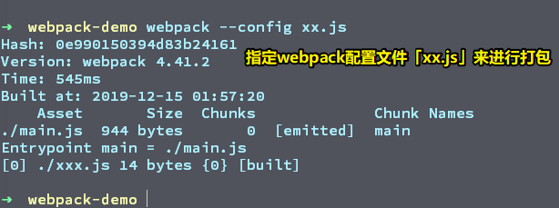

# webpack的使用，处理各类型文件

> Webpack4的基础使用

## ★为什么我们要使用webpack？以及如何安装它？

### ◇为啥要使用它？

**1）什么是前端工程化？**

在15、16年的时候，前端基本上没有使用webpack的需求，毕竟那个时候的绝大多数公司都是使用MVC这一套路去写代码

那么为啥现在18、19年要突然使用上了webpack呢？——原因简单，因为我们前端开始越做越大了，而做的内容也越来越复杂了！说白了，前端要干的活越来越多了！因此，我们必须用上webpack，而这也是我们之所以使用webpack的一个重要原因！

至此，前端开始工程化了！

那么工程化又是什么呢？

> 工程化是系统化、模块化、规范化的过程。即，让开发变得越来系统，越来越分模块，然后对规范也越来越重视。而工程化的目的主要是为了解决“**如何提高整个系统生产效率**” 的问题

总之，**我们可以把webpack理解成是一个可以帮助我们把项目做得更轻松的这么一个工具**。（想想柴火煮饭，与用电饭煲煮饭，如果有电饭煲煮饭为啥还要用柴火呢？难道用柴火是为了让饭煮得更香些吗？更能体现纯朴的味道吗？当然，如果没有电、电饭煲，那就用柴火呗！反正也是能吃到饭！只是这样效率并不高，如需要砍柴生火，还得看看火势是否过旺，不然会煮糊……总之，把煮饭的整个过程看做是一个系统，同样一个淘米输入，如果用上电饭煲，那么就能很快且稳定的吃上香喷喷的米饭，而如果用柴火的话，那么就费时费力了！总之，得到一碗米饭，电饭煲的存在可以让我们不用去干砍柴生火的活儿！）

> 注：想想软件工程、包工头承包工程（如如果只招来2、3个人显然工期会很长）……

**2）前端工程化的主要改变会发生在哪些方面？**

- 工具（没有webpack之前，前端做一个项目，只要一个编辑器，一个PS即可搞定！而现在则需要用到各种各样的东西，如webpack、node、Nginx等等，而这是第一方面的改变）

- 人员（第二方面的改变是在人员上的改变，在前端比较早期的时候，基本上都是一个人一个项目，毕竟只要写个静态页面甚是简单！然而，现在，前端它变成一个工程了，它不在是一个人就能解决得了的存在了！因此，现在人员多了，那我们就必须使用webpack，把不同人员所写的代码进行一个打包来生成最终的上线代码！）

- 写代码的方式（以前写代码，一上来就是一顿操作，直接撸起一大串JS代码，而现在则是要分模块化开发，分模块化做各种事情！）

总之，我们之所以使用webpack的终极原因就是为了「**工程化**」哈！

既然webpack的存在是为了「工程化」，那这webpack该怎么使用呢？——请往下看

### ◇使用webpack之前，先安装它

**1）安装node**

> webpack是依赖于node的，所以你在安装webpack之前，必须保证自己的电脑里边已经安装了node！毕竟webpack的源码也是基于node环境的，说白了，就是用跑在Node.js 环境下的 JS 写的！总之，webpack是鱼，没有Node这个水，那么鱼只能是木鱼了。

**2）通过 `npm install webpack –g` 全局安装Webpack**

> 在webpack4x之前，即1x、2x、3x版的webpack，直接使用 `npm install webpack –g`即可！然而现在的webpack4x还需要安装 `webpack-cli`才行，而这就类似于 vue 和 vue-cli的关系哈！ 总之，项目里边可以不安装webpack，但全局必须得安装一个！
>
>在学习webpack的使用过程中，推荐安装全局的，因为在写一些小demo练手的时候，就可以不用局部安装webpack了（也可以使用parcel来搞，毕竟它是零配置的，甚是方便！），当然，这并不会影响已有项目里边局部安装的webpack哈！

**3）输入`webpack –v` 能看到版本号，则表示安装成功**

**4）自己测试**

全局安装（耗时250s左右）：

``` bash
yarn global add webpack webpack-cli
```


局部安装（耗时106s左右，有缓存会快一点）：

``` bash
mkdir webpack-demo
cd webpack-demo
yarn init -y
yarn add webpack webpack-cli -D
```

该webpack-demo目录下的package.json：

``` json
{
  "name": "webpack-demo",
  "version": "1.0.0",
  "main": "index.js",
  "license": "MIT",
  "devDependencies": {
    "webpack": "^4.41.2",
    "webpack-cli": "^3.3.10"
  }
}
```

**➹：**[npm和yarn的区别，我们该如何选择? - 掘金](https://juejin.im/post/5ab89cc4f265da237506e367)

**➹：**[Npm vs Yarn 之备忘详单 - 晚晴幽草轩](https://www.jeffjade.com/2017/12/30/135-npm-vs-yarn-detial-memo/)

> 注：全局得有一个webpack，但打包项目的时候一般用的是局部的webpack！

---

## ★Webpack的一些概念？

### ◇入口（Entry）与出口（Output）

- entry：打包的起点，webpack必须有一个入口知道从哪开始处理

- output：处理完成后，结果文件输出到哪

这两个东西在webpack里边是非常重要的，一个webpack配置里边绝对会有这两个东西，而像loader、plugin可以没有，但entry和output必须要有。

为啥这样说呢？——因为entry是告知webpack从哪里开始打包，不然，webpack怎么知道自己应该从哪里开始打包呢？而与之相对应的output，则是告知把打包好的东西存放到哪儿！总之，一个用webpack打包的系统需要一个入口和出口（似乎可以把webpack看做是一个函数哈！）

---

在项目里边测试它们俩：

1）构析webpack配置文件，而这配置叫做 `webpack.config.js`，默认webpack会对这个webpack配置文件进行打包，当然，如果你不叫这个 `webpack.config.js` 这个名字也是可以的，不过这就得额为指定了！

2）配置文件的基础架构：

``` js
module.exports = {
  // 写你的配置
}
```

如果涉及到配置的合并，那么这其实就是把上边这个暴露出去的对象进行一个合并罢了！

注意，如果你直接这样做：

``` js
var xxx = {
  //你的配置
}
```

没有 `module.exports`一个对象，那么webpack是拿不到这个配置文件的，毕竟这对象没有暴露出去哈！

**3）简单的测试：**

> 一定要 `yarn init -y`一下，因为要用webpack打包，这个项目必须得是个npm包才行！说白了，你得有个 `package.json`文件才行！

在webpack.config.js里边写上以下代码：

``` js
module.exports = {
  // 写你的配置
  // entry是打包的起点，它的值的形式非常之多，如简单的就是直接指定一个字符串路径哈！
  // 这是最简单的单文件入口形式
  entry: './xxx.js', 
  // 这是最简单的出口形式，即直接指定一个filename属性，而该属性它指定打包完成之后，webpack输出的这个文件叫啥名字
  output: {
    'filename': './[name].js'
  }
}
```

有了一个简单的入口和出口即可开始打包（这是用全局姿势打的包）：

``` bash
#定位到项目webpack-demo目录，直接webpack一下即可
webpack
```

结果多了一个dist目录，并且其旗下还多了一个叫 `main.js`的文件：

```
G:\git-2019\webpack-demo
├── dist
|  └── main.js
├── package.json
├── webpack.config.js
├── xxx.js
└── yarn.lock
```
**4）一些常见问题？**

<mark>1、`mode`属性是个怎样的存在？</mark>

在webpack4.x里边，额外多了一个叫 `mode`属性（mode，模式）

mode属性它有两个值：一个是默认值 `production` （不写mode属性直接打包，webpack会有警告说你没有写mode属性，然后建议你写上，当然，最终默认会以production模式打包），还有一个是 `development`。

那么它们俩有啥区别呢？

> 一个是以生产模式打包，一个则是以开发模式打包（方便我们阅读打包出来的代码）！

<mark>2、关于webpack3.x和webpack4.x的差别？</mark>

webpack升级到版本4之后，它就有一个理念，即「**我要减少webpack的配置文件**」，所以webpack就推出了 `mode`这么一个属性，如果你把mode的值置为 `development`，那么webpack默认就不会去压缩我们的代码，而且你不需要做任何的配置！

测试打包结果如下：

``` js
// 开发模式：打包出来的main.js无压缩

/******/ (function(modules) { // webpackBootstrap
/******/ 	// The module cache
/******/ 	var installedModules = {};
//……

// 生成模式：打包出来的main.js有压缩

!function(e){var t={};function n(r){if(t[r])return t[r].exports; //……
```

而在webpack3.x里边，如果你不去配置压缩的话，那么打包出来的 `mian.js`是咩有经过压缩的哈！

总之，在webpack4.x里边，把mode置为 `production` ，除了帮我们解决压缩配置以外，还有 tree-shaking等等的功能！

总之，生产模式必备的一些配置，我们用上webpack4.x之后就不用我们自己去写了！

<mark>3、全局下的webpack与局部下的webpack有啥区别？</mark>

测试前提：全局安装个最新版的webpack4.x，然后在项目里边局部安装个3.x（如3.6.0）

开始测试：

在项目的package.json里边添加 `scripts`字段：

``` json
{
  "scripts": {
    "build": "webpack" 
  },
}
```

然后局部打包项目：

``` bash
yarn build

# 全局打包直接输入webpack即可
```

> 如果局部没有安装webpack，那么就会去找全局的webpack，总之优先查找局部的！

结果报错了，而错误内容大概是「在配置里边有个未知的mode属性」哈！说白了，webpack3.x不认识mode这个属性！

话又说回来，webpack为啥会有全局和局部之分呢？

简单来说，全局里边，webpack只能有一个（假设是4.x的），而在局部里边的webpack版本，有些项目是使用3.x的打包的，有些则是4.x的。举栗子来说，如果你在github里边，clone了一个xxx项目，而这个xxx项目是用3.x打包的，而这意味着webpack配置文件是针对3.x版的webpack，而你秉持着「使用最新版工具」原则，而且也不想局部安装webpack，于是你就注释掉了package.json里边有关webpack的开发依赖，然后使用webpack4.x全局去打包这个项目，那么结果就会出现各种各样的版本问题了，因此我们需要在局部里边安装3.x的webpack版本去处理相应的webpack配置！

总之，使用局部指定的webpack版本打包，保证了打包的正常运行！如果一股脑的用全局的webpack打包，那么不管是打包旧项目还是新项目，或多或少会发生不可预知的错误！

<mark>4、指定webpack配置文件？</mark>

我们在项目，如 `webpack-demo`的根目录里边，创建了一个叫 `webpack.config.js`，那么webpack默认就会以该配置文件来打包！即直接输入 `webpack` 即可打包

那么问题来了，假如我们把webpack配置文件改成 `xx.js`呢？

如果你还是按原来的直接 `webpack`去打包项目的话，那么大概会报「没有找到任何配置文件」这样的错误，更进一步说应该是没有找到任何的入口模块！


所以我们该如何指定webpack配置文件来进行打包呢？——很简单，直接这样即可：

``` bash
webpack --config xx.js
```



> 通常在 Vue 项目里边，你会发现在打包项目的时候，都是通过 `--config` 来指定webpack配置文件来进行打包的，而不是直接运行webpack来进行打包！

总之，写个`webpack.config.js`，可以让我们在打包项目时少敲几个字符！

**5）解析entry的值？**

<mark>数组值：</mark>

``` js
module.exports = {
  mode: 'development',
  entry: [
    './xxx.js',
    './yyy.js'
  ],
  output: {
    'filename': './[name].js'
  }
}
```


结果文件里边，即 `main.js` 里边，你会发现 `xxx.js`和 `yyy.js`这两个文件混合在一起了！

总之这种入口文件的形式，即你给entry一个数组值，那么就会把你在数组里边指定的这些文件全部打包到一起去！

<mark>对象值：</mark>

这是一种对象形式，通常当我们写多入口的时候，都会把entry指定为对象的形式。而对象里边的键名就是output里边的 `[name]`，之前我们用字符串和数组形式时，是咩有指定 `[name]`的值的，于是用了一个叫 `main`的名字作为默认名字！除了有 `[name]`以外，还有一个 `[hash]`，它的值正是我们使用webpack命令打包，然后终端所打印的日志 里边的第一行的`Hash`的值，如果你嫌它太长的话，你可以截取头几个字符，如 `[hash:6]`表示只截取hash值前6个字符！

如果对象只有一个键值对，大可看做是单入口，如果2个至多个，那么可看做是多入口。

在多入口里边，你有几个入口文件，那么最终就会输出几个结果文件

``` js
module.exports = {
  mode: 'development',
  entry: {
    'xxx': './xxx.js',
    'yyy': './yyy.js'
  },
  output: {
    'filename': './[name].[hash:6].js'
  }
}
```


当前目录结构：

```
G:\git-2019\webpack-demo
├── dist
|  ├── xxx.ca4307.js
|  └── yyy.ca4307.js
├── package.json
├── README.md
├── webpack.config.js
├── xxx.js
├── yarn.lock
└── yyy.js
```

问：

<mark>1、Hash是哪儿来的？</mark>

> Hash是webpack自动生成的，webpack每次打包它都会生成一个hash，而这是根据每次打包的文件名自动生成的，而且每次都是不一样的！

<mark>2、在多入口打包时，用[hash]打包出来的结果文件都有着同一个hash值？</mark>

> 可以使用 `[chunkhash]`，它是根据模块文件的内容计算所得的hash值，所以只要文件没有修改，那么每次打包的结果文件就不会让在用户浏览器下的缓存文件失效了！

**➹：**[Webpack中hash与chunkhash的区别，以及js与css的hash指纹解耦方案 - 寒月十八 - 博客园](https://www.cnblogs.com/ihardcoder/p/5623411.html)

说完入口和出口之间的关系之后，接下里说loader和plugin这两个重要的概念！

### ◇Loaders 与 Plugins


### ◇Module 和 Chunks

## ★各种资源的处理？

### ◇JavaScript的处理与编译？

### ◇css的处理与打包？

### ◇html处理？

### ◇图片等其他资源的处理？


## ★作业

1、实现以上所提到的所有功能

2、并且再此基础上加上对less的编译

3、加上对于字体图标的处理-iconfont

## ★总结

- 我一直认为使用个webpack就是在做工程化了，没想到这只是工程化的一部分！如开发规范、模块化开发模式、人员配置、git等工具使用等等都是工程化的一部分！

