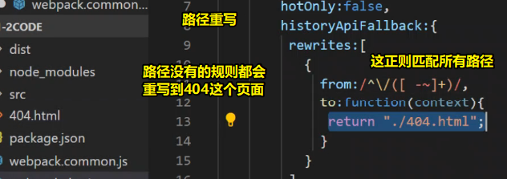

# 开发模式深入、代码分割、结果文件阅读

> 视频时长115分钟，所以我得在345分钟，即5.75个小时之内把它看完！（14个番茄）

## ★模式区分

### ◇为什么要分模式

因为在不同的场景下可能需要不同的配置，所以需要区分环境。

比如:

- 开发阶段：会额外用到一些调试功能，但为了快速打包和调试，可能不会使用压缩、tree-shaking、编译之类的功能。
  
- 上线阶段：生产模式下，为减少打包体积，必须使用压缩、tree-shaking、编译等功能，但不需要eslint等帮助开发调试的功能。

话说，就只有两种模式吗？即只有生产模式和开发模式这两种？

并不是的，大型点的项目还有测试模式等，除此之外，模式并不是webpack独有的概念，举例来说，同一份代码，在公司开发是一种模式，在家里开发也是一种模式，同样，在星巴克里边找个位置坐着也是一种开发模式！

**➹：**[前端架构设计3：测试核心 - axl234 - 博客园](https://www.cnblogs.com/axl234/p/9430277.html)

### ◇如何指定模式

有两种方式指定，但在这里只了解一种即可：

1）`webpack --env envname`：webpack会拿到envname这个值！envname可以是任意值，如生成模式「production」、在家开发模式「home」等

话说，我们的webpack配置文件如何才能拿到「envmae」这个值？

1. 把 `module.exports = {}` 改为 `module.exports = env => {}`，env就是webpack拿到的环境变量
2. 需要引入webpack-merge

做法：

创建3个文件，然后给上相应的配置即可：

```
webpack.common.js //通用配置，如处理js、css、html、图片等，总之什么地方都要用到的就抽离出来
webpack.dev.js 
webpack.pro.js
```

一个坑：

> 在开发模式下，如果你把CSS提取为单独的文件，那么会使得CSS无法live-reload和热更新，所以在开发模式就不能单独提取CSS文件了！

一个思想：

> 一定要把webpack配置文件当作是一个程序，而不是简单的一个填充数据的配置文件。因此对于我们的模式区分来说，完全可以用一个函数来搞！

合并规则：

> 根据不同的模式，往common配置里边添加 dev or pro，假如dev有处理js的，common也有处理js的，那么dev下的js配置，就会顶掉common下的js配置。总之一个新的配置，即合并出来的配置就是，common+dev or pro!

开发模式和生产模式下分别有什么？

开发模式：

- HotModuleReplacementPlugin（热更新）
- NamedModulesPlugin（在热加载时直接返回更新文件名，而不是文件的id，与HMR相关）

**➹：**[webpack插件之NamedModulesPlugin - 简书](https://www.jianshu.com/p/8499842defbe)

生产模式：

- 压缩（webpack4里边指定mode即可，如果不这样做，可以把 `optimization.minimize` 指定为true即可压缩）
- 代码分割等

配置scripts：

``` json
{
  "build": "webpack --env production --config webpack.common.js",
  "dev": "webpack-dev-server --env development --config webpack.common.js --open"
}
```

> 指定webpack打包的配置文件为 「webpack.common.js」，然后webpack就会读取该配置文件返回对象，而这个对象会根据「production」or「development」会有所不同，即会生成一个最终配置哈！而这也是 `npm run build` 和 `npm run dev` 的这么一个模式区分原理哈！

### ◇Webpack-dev-server常用配置

> 这是我们开发项目的核心配置！

开启开发模式，使用的是 `webpack-dev-server`（需要安装）来执行打包，而不是生产模式的`webpack`。

常用配置：

- inline：服务的开启模式，默认为true，因此一般删掉这个属性，如果显示设置为false，那么打开页面的时候，就会页面地址就会这样：`localhost:9001/webpack-dev-server`，总之为false，会把打包的进度条显示到页面，而不是console控制台里边！

- port：代理接口，把我们启动的服务开在哪个端口下

- historyApiFallback：路径重定向
- Hot：热更新
- lazy：懒编译
- overlay：错误遮罩
- proxy：代理请求

详解，即展示每个配置项会有什么效果：

<mark>1）热更新：</mark>

> 所谓热更新指的是无刷新更新页面，而不是修改代码保存，页面自动刷新！

有刷新和无刷新的区别：

有刷新即页面里边的状态会被重置，如定时器和计时器等，说白了所有的程序都会开始重新运行

而无刷新则是在保证页面的状态下能够更新我们的所更改的代码（热更新）

而自动的刷新得更新页面，则是「live-reload」

如果不配置热更新，那么默认情况下就是live-reload，即你修改个css，js等保存后，都会刷新页面

> 更改业务代码不需要重新打包，但如果更改了webpack配置，那就得重新打包！

开启热更新做法：

1. 只使用HMR插件是不行的，你还得配置，如：
2. 设置hot为true
3. 设置hotOnly为true，表示只允许热更新！

不管怎样，热更新才是我们真正想要的，它的效果在CSS体现上类似于我们直接在浏览器的控制台的Elements面板里边直接修改DOM元素的样式！

当然，目前这个热更新是不完美的，因为在日常开发中，除了修改CSS以外，还得修改JS哈！总之，目前这个热更新对CSS来说是完美的，但对JS来说是鸡肋！

要对JS进行热更新，得进行一些配置才行，不然是无法热更新的，它可不像CSS那样简单配置个hot和hotOnly就可以热更新了。

所以，如何对JS进行热更新呢？

很简单，往模块JS文件里边的最后添加这段代码即可：

``` js
if(module.hot) {
  module.hot.accept()
}
```

> module是这个模块文件的全局变量！

举例来说，入口文件是app.js，然后把上边这代码扔进去，只要app.js里边的代码修改了，就会热更新，而且假如你在app.js里边import了其它的js模块，如app2.js，那么app2.js假如发生代码更新，也会产生热更新的效果，说白了，上边的配置代码是有个作用域的，即顶级作用域搞了这段代码，那么子孙后代发生了代码更新都会热更新，即便import进来的js模块也是如此！

当然，我们也可以针对某个函数进行热更新，即把上边的代码写到函数里边去，毕竟函数它有它自己的局部作用域哈！

<mark>2）historyApiFallback</mark>

这是一个比较好玩的而且很有用的配置项

为什么需要它？或者说它是用来解决什么问题的？


如果你往url里边追加其它无效的path，那么显然这是找不到这个页面的，既然找不到这个页面，那么作为一个成熟的网站来说，这理应是呈现个404页面，而不是「Cannot Get /xxx」

而「historyApiFallback」正是用来解决这种问题的！

做法：

简单使用：

把historyApiFallback的值设置为true，那么即便输入无效的路径也会保证是原来有效的index页面！

更深层次的配置使用：



> 输入找不到的路径都会跳到404页面

除了给定规定死的404页面，还可以根据路径匹配其它页面：


> 关于是否能拿到路径参数，可以看看match拿的值

不过需要注意的是，千万不要把这种操作姿势作为我们正式上线的404页面，因为上线之后，这配置项就管不到我们的项目了，所以这只能开发模式下使用

总之，所有在开发模式里边写的东西，在上线之后都没有用了，即GG了！

问：

<mark>1、fallback是啥？</mark>

fallback即退路之意，如果没有找到页面，那么就回到有效的那个页面

总之它表示「当一旦不成功的时候，提前预备的用来兜底的东西」

类似的有「polyfill」，它表示将不完善（缺失、不正确）的功能填，然后按照标准API完善之，说白了，这是为了兼容性而实现的API统称！

**➹：**[polyfill和fallback到底是什么？ - 知乎](https://www.zhihu.com/question/46701527)

<mark>3）proxy</mark>

> 这是个核心的、常用的配置项，用于路径代理转发。（用于解决跨域的问题，不过项目上线后，就GG了，毕竟在生成模式里边这是webpack自己开的服务哈！当然项目上线后你可以直接叫后端CORS即可，而这是最简单的允许跨域做法！）

用法：


注意，一旦要改变Origin为true，不然发请求会有500这样的错误信息！

> 了解了这个配置项，那么对于vue-cli的那一套代理配置也就很简单了！

<mark>4）overlay</mark>

> 错误遮罩，用过vue-cli你就会知道，报错时有页面有个黑色的遮罩，然后页面内容是错误信息，如果你把这个值设置为false，那么就会把错误提示log在控制台里边！

### ◇Source-map

> 在开发模式下，这个就不得不提了

为方便调试，我们需要知道打包后的代码对应于原文件的位置。

如果代码有一处错误，无source-map只能追踪到错误发生在打包后文件的哪个位置，但是打包后的文件不方便阅读。

有了source-map，就可以查看错误发生在原模块的哪个地方。

做法（开启这个source-map是非常简单的）：

``` js
{
  devtool: 'cheap-module-source-map'
}
```

source-map小结：


以上就是开发模式的详解啦！接下来会说到一些比较骚的操作！

### ◇自己手动搭建

关于webpack-dev-server，原理、代码都很简单！所以搭建起来毫不费力！

可既然有了这个工具为啥还要自己搭建呢？

因为，如果我们的项目做的比较精细而且是大型的项目，那么往往我们会自己手动搭建！总之，这是为了能够让我们有更高点的自定义哈！


## ★代码分割

### ◇多页面应用

### ◇单页面应用

### ◇所以一般这么打包

### ◇版本差异

### ◇压缩


