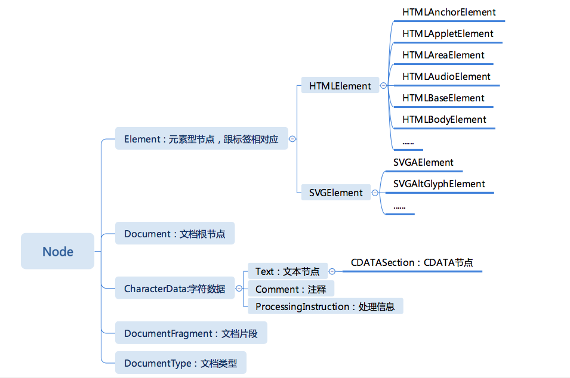

# Dom的一些理解和API的使用

> 原文：[Dom的一些理解和API的使用 - 知乎](https://zhuanlan.zhihu.com/p/98623403)

## ★一棵树

其实，你可以把网页看作是棵树

有这样一段简单的HTML代码：

``` html
<!doctype html>
<html lang="en">
  <head>
    <title>Dom</title>
  </head>
  <body>
    <h1>Hello, world!</h1>
    <p>How are you?</p>
  </body>
</html>
```

你把这段代码立体化，就成了这个样子：


> 父“stem”是根元素，子“branches”是嵌套元素，“leaves”是元素中的内容。说白了，树干是html，树干的分支是嵌套元素，树叶则是元素里边的内容

那么Js如何操作这棵树呢？

其实Js是用document来操控页面的

何以见得？——打开控制台，log一下`window.document`即可：


## ★记住一个事实DOM很难用

原生的DOM API是很难用的，但是我们可以让它变的好用，即给它封装一下即可！

可什么叫做**封装**呢？

> 电脑笔记本就是cpu，内存，主板，硬盘，显卡的封装，用户只需要接触显示器，键盘，鼠标就能操作复杂的计算机，这就是封装

既然说到了封装，那么「接口」这个概念就不得不说了

**什么是接口？**

> 被封装的东西需要暴漏一些东西给外部，这些功能就是接口，就像USB接口，HDMI接口……设备只要支持这些接口就能和被封装的东西通讯。

而上文所提到的「Document」就是一个接口，即它是作为网页内容的入口点而存在的，也就是操控DOM树的入口点！Document为整个HTML文档提供了全局功能，比如如何获取当前页面的 URL 、如何在DOM树里边创建新的元素……

> 如果你还不了解接口，你就直接把Document、Node、ChildNode等当作是接口，即它们都是objects。更多interfaces，请看 [Web APIs](https://developer.mozilla.org/en-US/docs/Web/API)
> 
> 我不知道是不是C++的语法，Document、ChildNode等都是大驼峰，也就是所谓的接口类，而我们的`document.getElementById()`里边的 `document`其实就是一个实例对象哈！既然是个对象，那么它就会有很多属性和方法……
>
> 在Java里边的接口，是百分比抽象的，即只有方法名，没有方法实现，即只是规定了有哪些功能而已！然后再去用代码实现这些接口，如搞了一个叫Document的类，然后我们 `const document = new Document()`一下！
> 
> 而别人提供的API其实是「Specifications」，即使用说明书，就像是你在京东买了一张电脑椅，然后邮寄过来的都是一些零部件，当你要把这些零部件组装成电脑椅的时候，那么你就需要面向过程，调用一些API来组装完成一张电脑椅。

而基于原生 DOM API 被封装的代码我们叫做**库**，也就是提供给他人用的工具代码，比如说jQuery……

而库暴露出来的函数或者属性我们就叫做**API**（应用编程接口）

当你的库变得很大，并且**需要学习才能看懂**，那么这个库就叫做**框架**，比如Vue，React……

## ★常用的 DOM API

> 所有的DOM API：[Document - Web APIs - MDN](https://developer.mozilla.org/en-US/docs/Web/API/Document)

1）获取元素

``` js
window.idxxx  // or 直接idxxx 
document.getElementByid('idxxx') //id
document.getElementsByTagName('div')[0] //标签名
document.getElementsByClassName('red')[0]  //类名
document.querySelector('#idxxx') //id
document.querySelectorAll('.red') //类名

// 推荐使用：
document.querySelector('#idxxx') //该API只返回匹配中的第一个元素，所以用来获取id选择器挺好的
document.querySelectorAll('.red') //返回匹配到的所有元素节点列表，而类名显然一般会有多个，因此用这个API去获取元素会好很多！
```

2）创建一个元素节点

``` js
// 需要赋值，而且这是个游离在内存里边的DOM碎片
let div = document.createElement('div')
// 要在页面中显示这个元素，需要插入到页面里边去
document.body.appendChild('div')
```

3）删除一个节点

语法：`childNode.remove()`

``` html
<div id="div-01">Here is div-01</div>
<div id="div-02">Here is div-02</div>
<div id="div-03">Here is div-03</div>
```

``` js
var el = document.getElementById('div-02')
//  把id 为 'div-02' 的 div 从DOM树里边删掉，
el.remove()
```

4）改属性

改class：

``` js
// 全覆盖
div.className="red blue"
// 添加class
div.classList.add('red')
```

改style：

``` js
div.style='width:100px;color:red;'
```

5）查节点

``` js
// 查父类节点
node.parentNode
// 查子类节点
node.childNodes
// 查兄弟姐妹节点，别忘了要排除自己
node.parentNode.childNodes
```

## ★总结

每一个HTML页面都是HTMLDocument的实例，而实例对象的名字为document

> HTMLDocument <- Document <- Node <- EventTarget <- Object

在HTML页面里边是很多种类型的节点的，而所有节点都有一个统一的接口 Node。按照继承关系能够把 Node 和其子类梳理成为下图的一棵树：



> 可见从Node那里开始产生了分支，我之前还以为Object之后是Document

**➹：**[重学前端笔记23-DOM API - 掘金](https://juejin.im/post/5c9c1a71e51d451e7975f41c#heading-1)

有关Document的API：

**➹：**[Document - Web APIs - MDN](https://developer.mozilla.org/en-US/docs/Web/API/Document)

有关Node的API：

**➹：**[Node - Web APIs - MDN](https://developer.mozilla.org/en-US/docs/Web/API/Node)

有关ChildNode的API：

**➹：**[ChildNode - Web APIs - MDN](https://developer.mozilla.org/en-US/docs/Web/API/ChildNode)

有关EventTarget的API：

**➹：**[EventTarget - Web APIs - MDN](https://developer.mozilla.org/en-US/docs/Web/API/EventTarget)


## ★Q&A

### 1、一个简单的DOM库？

> **➹：**[1105946494/DOM](https://github.com/1105946494/DOM)

``` js
window.dom = {
    create(string) {//用于创建节点
        const container = document.createElement("template");
        container.innerHTML = string.trim();
        return container.content.firstChild;
    },
    after(node, node2) {//用于新增弟弟
        node.parentNode.insertBefore(node2, node.nextSibling);
    },
    before(node, node2) {//用于新增哥哥
        node.parentNode.insertBefore(node2, node);
    },
    append(parent, node) {//用于新增儿子
        parent.appendChild(node)
    },
    wrap(node, parent) {//用于新增爸爸
        dom.before(node, parent)
        dom.append(parent, node)
    },
    remove(node) {//用于删除节点
        node.parentNode.removeChild(node)
        return node
    },
    empty(node) {//用于删除后代，就是全部删除
        const array = []
        let x = node.firstChild
        while (x) {
            array.push(dom.remove(node.firstChild))
            x = node.firstChild
        }
        return array
    },
    attr(node, name, value) { // 重载 ，用于读写属性
        if (arguments.length === 3) {
            node.setAttribute(name, value)
        } else if (arguments.length === 2) {
            return node.getAttribute(name)
        }
    },
    text(node, string) { // 适配，用于读写文本内容
        if (arguments.length === 2) {
            if ('innerText' in node) {
                node.innerText = string
            } else {
                node.textContent = string
            }
        } else if (arguments.length === 1) {
            if ('innerText' in node) {
                return node.innerText
            } else {
                return node.textContent
            }
        }
    },
    html(node, string) {//用于读写HTML内容
        if (arguments.length === 2) {
            node.innerHTML = string
        } else if (arguments.length === 1) {
            return node.innerHTML
        }
    },
    style(node, name, value) {//用于修改style
        if (arguments.length === 3) {
            // dom.style(div, 'color', 'red')
            node.style[name] = value
        } else if (arguments.length === 2) {
            if (typeof name === 'string') {
                // dom.style(div, 'color')
                return node.style[name]
            } else if (name instanceof Object) {
                // dom.style(div, {color: 'red'})
                const object = name
                for (let key in object) {
                    node.style[key] = object[key]
                }
            }
        }
    },
    class: {
        add(node, className) {//用于添加class
            node.classList.add(className)
        },
        remove(node, className) {//用于删除class
            node.classList.remove(className)
        },
        has(node, className) {
            return node.classList.contains(className)
        }
    },
    on(node, eventName, fn) {//用于添加事件监听
        node.addEventListener(eventName, fn)
    },
    off(node, eventName, fn) {//用于删除事件监听
        node.removeEventListener(eventName, fn)
    },
    find(selector, scope) {//用于获取标签或标签们
        return (scope || document).querySelectorAll(selector)
    },
    parent(node) {//用于获取父元素
        return node.parentNode
    },
    children(node) {//用于获取子元素
        return node.children
    },
    siblings(node) {//用于获取兄弟姐妹元素
        return Array.from(node.parentNode.children)
            .filter(n => n !== node)
    },
    next(node) {//用于获取弟弟
        let x = node.nextSibling
        while (x && x.nodeType === 3) {
            x = x.nextSibling
        }
        return x
    },
    previous(node) {//用于获取哥哥
        let x = node.previousSibling
        while (x && x.nodeType === 3) {
            x = x.previousSibling
        }
        return x
    },
    each(nodeList, fn) {//用于遍历所有节点
        for (let i = 0; i < nodeList.length; i++) {
            fn.call(null, nodeList[i])
        }
    },
    index(node) {//用于获取排行老几
        const list = dom.children(node.parentNode)
        let i
        for (i = 0; i < list.length; i++) {
            if (list[i] === node) {
                break
            }
        }
        return i
    }
};
```


