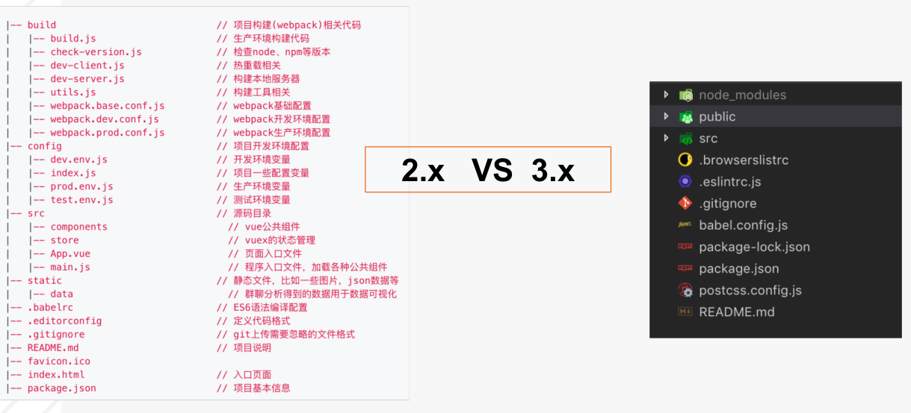

# 01-项目介绍及前端环境搭建

## ★项目介绍

> 这个项目会用到现在很多公司里边主流的技术栈，如Vue+Vant+ES6+Node.js+Koa+MongoDB

### <mark>1）项目背景</mark>

> 为啥要做这个项目？

唯创在围绕农机做一个项目，而农机商城是这个项目里边其中的一个子模块，或者说是子系统。

从这个项目单独提取某个功能来讲解一下 -> 目的 -> 让你明白一个项目从前端到后端到数据库一个完整的全栈项目是如何去开发的，以及在实际项目中都需要考虑哪些东西

如果农机商城会做了，那么像是电商商城、外卖系统等，其实都是大同小异的，毕竟技术栈大概都是这些东西

### <mark>2）项目功能介绍——项目演示</mark>

#### 1、如何启动一个项目？

打开终端：

- 启动数据库服务
- 启动后端应用程序服务
- 启动前端应用程序服务

#### 2、有哪些模块？

1. 首页模块 -> 轮播、左滑右滑
2. 分类模块 -> 有各类的农机 -> 可上拉更新，下拉每次加载10条数据
3. 购物车 -> 结算
4. 我的 -> 登录和注册 -> 密码是加盐加密的，即密码在数据库里边显示的是一段随机字符数据 -> 加盐加密是为了防止密码被破解 -> 什么时候加盐，什么是加密，之后会说到 -> 防止用户重复提交，如网络问题，导致用户以为页面没有反应，于是重复提交


该项目也有相应的PSD图，美工 -> 设计PSD图 -> 切图 -> 前端写页面

#### 3、项目是前后端分离的，也是响应式的

该项目是前后端数据分离的 -> 什么叫前后端数据分离？ -> 相当于前端是一个项目，而后端也是一个项目，然后前后端通过ajax请求实现数据的交互、通信 -> 好处 -> 前端更专注于前端项目 -> 后端更专注于后端项目 -> 当前后端分离之后，可让代码结构更加清晰

学过Java的都知道JSP -> 掺和着HTML、JS、JSP语法的代码 -> 做小项目还行，但是做公司级项目的话，这种前后端混合在一起的会出现很多很多的问题

总之，该项目是基于前后端数据分离而做的，而且也是基于移动端的，你可以看到，切换到不同的设备，页面的布局并没有坏掉，说白了，项目有做响应式设计！

#### 4、老师讲课的顺序

先做个前端界面（界面比较简单，但实用）

### <mark>3）项目技术栈</mark>

> Vue+Vant+ES6+Node.js+Koa+MongoDB

#### 1、什么叫项目技术栈？

简单来说，就是我们这个项目采用了哪些技术，或者说你能学到哪些技术

如Vue、Nodejs……

#### 2、什么是组件库？

举栗来说，我要做个轮播图：

1. 可用原生代码实现
2. 也可用组件库的一些现成功能来直接用起来，说白了，用他人写好的东西 -> 目的 -> 提高我们的开发效率 -> 如Vant（有赞的组件库，适合电商项目）

#### 3、ES6？

存在兼容性问题，可为啥主流公司都要用它呢？

因为存在相应的工具可以把ES6转化成浏览器支持的ES5语法

而且ES6引入了很多新的特性，可以大大提高我们的开发效率

总之，现在大部分公司用的是ES6+

#### 4、Node.js ？

Node.js 它不能算作一个后端语言，它就是一个平台，相当于通过这个平台，可以让JS 运行在服务端

或许你会问到「我从事的是前端工程师，为啥还要学Node.js 呢？」

因为现在很多公司的招聘要求，都会写到「至少了解一门后端语言者会优先考虑，如Node.js 」

现在有这么一个概念——大前端

那么什么是大前端呢？——作为前端，我们不单只了解前端的知识，还得了解一定的后端知识，如目前很火的Node.js 

#### 5、Koa是啥？

基于Node.js 的这么一个后端框架，当然，这也是基于MVC的框架

Koa的前身是Express

#### 6、MongoDB是啥？

指的是一个数据库哈！很多人在学校里边都学过数据库，不过大多都是关系型数据库，如MySQL、SQL Server、Oracle等

而MongoDB则属于KV数据库，即键值对数据库，之后会讲到这种数据库跟其它的关系型数据库有什么差别

#### 7、小结

学完这个项目后 -> 可认为是准全栈工程师（小白级）

总之，用到以上技术，就可以说是所谓的全栈开发了

### <mark>4）作为一个完整的项目，涉及到3部分</mark>


#### 1、前端部分？

涉及到的技术主要有3个：HTML、CSS、JavaScript

话说，什么是前端呢？

能看到所有界面的部分都属于前端 ，如按钮、导航条、tab、录播、价格信息等都属于前端要干的！

为啥咩有Vue呢？

因为Vue都是基于上边提到的三种技术的，总之这三种技术，相当于是C、H、O之类的存在吧！

#### 2、数据库部分？

话说，界面是有数据的，可这些数据是写死的吗？

显然这是不是的，拿电商网站来说，商品信息是贼鸡儿多的，如果数据写死了，那要写多少个页面？

这些数据都是存在数据库里边的，数据库顾名思义，存储数据的仓库，如MongoDB

#### 3、后端部分？

话说，前端的这些数据，是直接连接数据库，然后显示在前端的吗？

同样，显然这并不是哈！

因为还有第三部分——后端部分，后端可以由很多语言来进行开发，如Java、PHP……以及作为前端都要会的一种技术——Node.js 

#### 4、小结

前端显示的所有数据：

前端 -> 发送推荐商品列表的请求 -> 后端 -> 根据请求，到数据库里边查询所有推荐商品列表的数据 -> 查询完成 -> 数据库 -> 把数据返回给后端 -> 后端把接收到的数据响应回给前端 -> 前端界面展示数据

现在的网站、微信小程序、混合APP等，涉及的技术栈，都涉及到了「前端、后端、数据库」这三大部分

前端 -> 给用户看的

后端 -> 接收请求，连接数据库的 

数据库 -> 存储一些数据的

总之，一个完整的网站、APP等，是由这三大部分组成的，而了解这一点对我们的开发是非常重要的！

## ★项目前端结构初始化及目录结构介绍——VueCli3

> 我们做一个项目肯定是要有一个项目结构的，而项目结构的搭建，我们使用的是脚手架——VueCLI3

### <mark>1）环境搭建</mark>

#### 1、大致过程

1. 安装[node](https://nodejs.org/zh-cn/)，版本查看（用于检测node是否安装成功）：`node -v`
2. 安装VueCLi：`npm install -g @vue/cli`（如果是mac电脑，然后需要全局安装，那么得加上`sudo`，如`sudo npm ……`这样，这是为了让你有管理员权限）
3. 查看版本号：`vue -V`（注意这是大V，而前边的则是小v）
4. 创建项目：`vue create shop` or `vue ui`（图形化界面创建项目，适合不了解终端的初学者）
5. 进入项目：`cd shop`
6. 运行项目：`npm run serve`

#### 2、什么是脚手架？

盖个房子，需要用竹竿搭个架子出来，然后再去盖，同理，开发项目也是如此

总之，Vue提供了一个脚手架，而通过这个脚手架可以让我们快速搭建出整个项目的结构出来

#### 3、开发工具选择？

- VSCode：免费、速度快、很强大、可装插件扩展功能
- Chrome
- Node：VueCLI是基于node的，Node相当于是一个服务，用于管理我们需要的各种各样的包文件
- VueCLI3.x：相较于vuecli2.x，发生了较大的变化。（讲课时会用最新版本）
- npm


#### 4、什么是npm？

node环境安装后，就会自带一个叫npm（node package manage）的node包管理工具，说白了，安装了node，就不用安装npm了

#### 5、VueCLI创建项目时，需要勾选哪些东西？

> 空格选中，回车下一步

- 默认安装
- 个性化安装
  - Babel（项目用到，因为得用ES6语法）
  - Router（路由管理）
  - Vuex（状态管理，也是vue全家桶里边的一个很重要的成员）
  - CSS Pre-processors（dart sass）
  - Linter（代码语法检查）
    - router -> hash模式，而history模式用不到
    - sass -> dart sass
    - Linter -> 有错误时报错 -> 第一个 -> 在on Save时检查
    - Babel -> 单独一个文件
    - 是否保存以上操作为一个模板，下次创建项目时直接用就好了 -> No

联网下载东西……

如果网路不稳定报错了（出现了error），删掉项目，重来一次，如果出现的是warning则不需要

> 用淘宝源报错了 -> 删除项目 -> 使用`nrm use npm`切换回npm的源 -> 创建项目

启动 `yarn serve` -> 看到预期的界面 -> 证明vuecli创建项目成功

### <mark>2）2.x VueCLI VS 3.x VueCLI</mark>

```
G:\2020-github\am-shop
├── babel.config.js
├── package.json
├── public
|  ├── favicon.ico
|  └── index.html
├── README.md
├── src
|  ├── App.vue
|  ├── assets
|  |  └── logo.png
|  ├── components
|  |  └── HelloWorld.vue
|  ├── main.js
|  ├── router
|  |  └── index.js
|  ├── store
|  |  └── index.js
|  └── views
|     ├── About.vue
|     └── Home.vue
└── yarn.lock
```

#### 1、目录结构分析（VueCLI3创建的项目）

- node_modules：安装的依赖包都放在这儿，这个目录不需要提交到版本控制系统里边，也不需要上传到github，只要有package.json这个文件在就好了
- public：公有的，tab标签页顶部的logo，页面入口文件（只有一个叫app的div），如果浏览器没有开启JS ，那么页面会显示「We're sorry but……」，当然一般用户浏览器都会开启JS的。话说，什么样的文件需要放到该目录下呢？——不需要被打包的文件
- src：源文件，代码都写在这儿里边的！
- 剩下的都是配置文件

2、生产环境 和 开发环境？

目前，我们用vuecli创建的项目就是开发环境下的项目，项目开发完毕后，我们需要打包上线，而这打包操作是webpack来做的，打包完成后的结果，我们需要把这结果部署到服务器上。如果有些文件不需要被打包，如像什么语法检查之类的，都可以放到public里边去哈！

3、dependencies vs devDependencies？

前者的依赖，上线之后还会用到，如vue、vue-router、vuex，而后者是开发依赖，上线之后，就用不到了，如eslint等等，反正，后者用于辅助开发，前者则是实打实的需要在浏览器里边跑的代码！

4、yarn.lock？

锁定包的版本号，保证如果某个包即便升级了，项目也能正常运行起来！

5、README.md？

项目介绍，尤其是在面试的时候，一定要好好写清楚这个项目到底是个啥

6、VueCLI2创建出来的项目是长啥样的？



可见：

- vuecli2：目录结构是多么的复杂、配置文件直接放在外边、安装方式与3的差不多
- vuecli3：目录结构是多么的简洁、很多配置文件都放到node_modules里边去了，总之，很多情况下，这些配置我们默认是不可见的

## ★移动端屏幕适配方案

- 百分比
- 媒体查询（Media Query）
- Flex弹性盒模型
- rem

## ★Vue Router

- Vue Router是 [Vue.js](http://cn.vuejs.org/) 官方的路由管理器。它和Vue.js的核心深度集成，让构建单页面应用变得易如反掌
- router.js
- router-link
- router-view

## ★git版本控制

```bash
git init
git add *
git commit -m "init shop"
# 创建远程仓库
git remote add origin https://github.com/xxx/xxx.git
git push -U origin master
```

