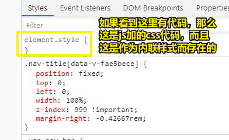
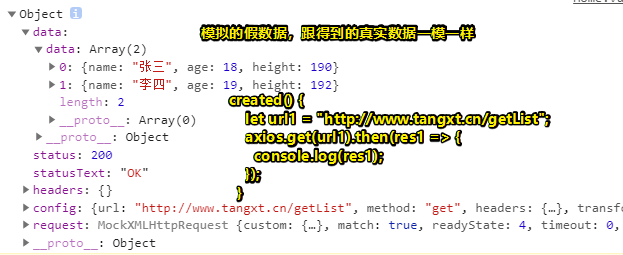
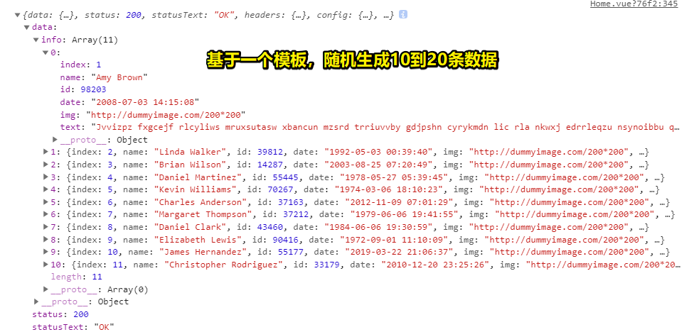

# 03-Axios 及 Mock.js

## ★首页

### <mark>1）完成首页推荐商品</mark>

#### 1、Vue 和 React 的 template 旗下，只有一个元素包裹其它元素，不然会报错！

#### 2、猜你喜欢？ 

推荐算法 -> 基于大数据

#### 3、一个你不知道的细节？



#### 4、一个 bug？

``` css
.home {
  padding: 16px;
}
```

在我手机上的效果：


改成 `padding: 16px 20px 16px 20px;` 就咩有图片溢出了。我也不知道为啥会这样，或许是 padding 挤压了 content 的大小

### <mark>2）弹性盒模型</mark>

两栏布局

## ★Ajax & Axios

* Ajax：Asynchronous JavaScript and XML
* Ajax 原理

* Axios 是一个基于 Promise 的 HTTP 库
* 安装 axios： `npm install axios --save` or `yarn add axios` 

### <mark>1）什么时候发送 ajax 请求？</mark>

created 阶段

### <mark>2）什么叫钩子函数？</mark>

`new Vue()` 这个操作会经历一个生命周期，每个阶段都会自动调用一个钩子函数，而我们可以往钩子函数添加要处理的代码！

如果不涉及操作真实 DOM -> created -> 反之写在 mounted

### <mark>3）什么是 Ajax？</mark>

不刷新界面的请求，如表单校验之用户名，用户名似乎被校验，肯定需要发送请求的，因为需要去查询数据库，而我们在各大网站注册时，输入用户名，然后移动下一个输入框，被告知「用户名已被占用了」，可见这其中发送了一个 ajax 请求，而这是无刷新的！可见提高了用户体验，不然等所有数据填充好后，再发送就不太好了。

### <mark>4）Ajax 原理？</mark>

1. 创建XMLHttpRequest对象
2. 发送请求
3. 等待服务器端响应 -> 监听 -> 判断各种状态码
4. 对返回的数据进行相应的处理

demo：[Ajax 原理 · ppambler/am-shop@1a691ef](https://github.com/ppambler/am-shop/commit/1a691efffe20b71636dcd4ee9175e517253e1261)

细节理解：

1. 兼容 IE 处理 -> `new ActiveXObject("Microsoft.XMLHTTP")` -> `new XMLHttpRequest()` 较新
2. `xmlhttp.open("GET", movieUrl, true)` -> 第三个参数一般为 true，表示异步请求 -> 不等结果
3. 得到的数据是字符串 -> 需要我们把字符串转化为 JSON
4. 跨域？ -> 使用服务器代理可解决 -> 如这样 `https://bird.ioliu.cn/v2?url=https://api.douban.com/v2/movie/top250` ，我们用了 `bird.ioliu.cn` 这个 url 指向的服务器作为代理 -> 如果你直接这样 `https://api.douban.com/v2/movie/top250` ，就会报跨域的错误！
5. 把数据显示到界面

数据接口地址：

**➹：**[xCss/JsonBird: 🐣A remote data interface proxy service - 一个远程数据接口代理服务](https://github.com/xCss/JsonBird)

### <mark>5）什么是跨域？</mark>

A 域发请求给 B 域接收 -> 但正常情况下，这是不被允许的

如 `localhost:8081` 这个域 -> 发请求给 `api.douban.com` 这个域 -> 这是不被允许的

只要，违反以下三点，即为非同源：

* 协议相同
* 域名相同
* 端口相同

而这意味着，你不能做以下三件事：

（1） Cookie、LocalStorage 和 IndexDB 无法读取。

（2） DOM 无法获得。

（3） AJAX 请求不能发送。

豆瓣电影这个接口，目前不能用哈！小程序也无法用，除非你用了代理服务器！

**➹：**[浏览器同源政策及其规避方法 - 阮一峰的网络日志](https://www.ruanyifeng.com/blog/2016/04/same-origin-policy.html)

### <mark>6）每次都要写一个Ajax方法吗？有没有封装好的库来帮我们做ajax请求？</mark>

Axios可以帮我们做。

### <mark>7）Axios？</mark>

只有理解了Ajax原理，以及Promise，你才用得会Axios！

安装：

``` bash
yarn add axios
```

> 上线后还要使用

### <mark>8）get与post的区别？</mark>

应用场景：

* get：从服务器那里获取数据
* post：提交用户输入的数据到服务器

其它差别：

* get：参数是明文的，而且传输的参数体积比较小，毕竟这在请求头里边
* post：参数是看不到的，参数大，毕竟这在请求body里边

当然，还有其它差别

### <mark>9）Promise？</mark>

ES6的新语法，主要用来解决异步操作

那么啥是异步操作呢？

举个栗子来说，如回调地狱：

``` js
// A请求
$.get('url', {}, () => {
  // B请求
  $.get(, , () => {
    // C请求
    $.get(, , () => {

    })
  })
})
```

A请求完之后，再到B，B完了再到C……

可见，这一层层回调起来特别深，而这并不好，而Promise的存在则可以把这种很深嵌套变成扁平化的！

如 `$.get().then(()={}).then(()=>{})` 

不过，现在建议的都是用async和await了，可以让我们的代码变成同步代码，效果类似于加了then

## ★Mock.js

* <http://mockjs.com/>
* 生成随机数据，拦截 Ajax 请求
* 安装 mockjs： `npm install mockjs -D` or `yarn add -D mockjs` 
* Demo

### <mark>1）什么是mockjs？</mark>

我们这个项目是前后端分离，使用ajax进行前后端通信

但，有这么一个问题是：「在我们实际开发中，有的时候，后端接口比较慢才出来，而且接口出来以后，还得有相应的文档，这岂不是更慢了？」

难道我们前端，要一直等着接口来了，以及文档写好了，才去开发吗？

显然，不能这样做，毕竟这未免效率太低了，而且这也忒TM被动了

那么我们是否可以创造一些假的数据来模拟后端接口呢？

显然，这是可以的

方案有：

1. 生成一个json文件 -> 有局限性，如数据写死的，不是随机的！
2. 模拟生成随机数据 -> mockjs

使用mockjs：

> 生成随机数据，拦截 Ajax 请求。文档：[Mock.js](http://mockjs.com/)

安装：

``` bash
yarn add -D mockjs
```

> 上线后不需要用到数据模拟，毕竟你项目都上线了，后端还没有接口出来吗？

使用：

1. 创建 `src/mock/mock.js` 
2. 数据多界面会被用到 -> 在main.js引入mock.js
3. 创建data.json

4.mock.js -> 导入安装的mockjs，以及有数据的data.json -> `Mock.mock('假url，一般需要与后端提供的接口地址对应',{data:'假数据'})` -> 一般会先有接口文档出现，然后再有真实数据的API接口 -> 而这叫做「拦截Ajax请求」，而刚好对应官网所说的「拦截 Ajax 请求」 -> 即我们发送了假url的ajax请求，但是被Mock这个对象给拦截下来，然后把我们所写的假数据直接返回给界面了



如何生成随机数据？

1. 有 `|` 表示有规则 -> 有初始值，表示这个值的类型是String，还是Number等类型，即你写5，那就是Number类型的，你写 `'5'` ，那就是String类型的！
2. 正则表达式
3. 图片
4. 商品图片、名称、价格都随机生成

随机数据高级用法：

``` json
Mock.mock("http://www.tangxt.cn/list", {
  "info|10-20": [
    {
      "index|+1": 1,
      name: "@first @last",
      id: "@integer(10000,99999)",
      date: "@datetime",
      img: '@image("200*200")',
      text: "@sentence(6, 22)"
    }
  ]
});
```

效果：



### <mark>2）json？</mark>

json是前后端数据交互的一种数据格式，目前一般用的数据交互格式就是json

而ajax，早期则是用xml格式作为交互格式

然而，xml这种格式相较于json来讲，它的文件体积较大，所以现在基本上用的就是json了

而我们mock的数据，即那个 `data.json` 就是相当于后端传过来的json数据！

### <mark>3）正则表达式？</mark>

正则表达式是用来匹配字符串的

如，注册邮箱，邮箱地址这个字符串是有特定格式，如有个 `@` 符号， `xxx.com` 等

如，手机号码，1开头，有固定的号段，都是数字

还有更复杂的字符串格式！

Mock也支持正则表达式写法

### <mark>4）推荐商品随机生成？</mark>

随机生成100个数据，而不是之前写死的那么几条数据

Mock数据的存在 -> 替代了「等待后端工程师拿真实的接口数据 」-> 大大的提高了开发效率

> 我突然觉得，用人家写好的工具，来提升了我们自己的开发效率，是件贼让人舒服的事儿，这样就有更多的时间去学一些「编程内功」了，学一些其它领域的东西了，学习新东西，也可以让人感到兴奋、产生愉悦感

我猜测mock的原理：

API是这样的： `Mock.mock('url',Object|Function)` 

`url` 是个key，只要发送的ajax请求与这个url匹配，就会拦截，然后把第二个参数，如果是函数，那就把返回的数据作为data的值，给前端界面！

mock官网说到「如果图片比较小，那就是base64编码格式的」，而且生的是色块

关于如何写mock数据？

你用到了什么数据，然后再去官网查询，然后写，而不是把官网看一遍，再去写！

> 可以模拟拦截Ajax请求的响应时间 -> `Mock.setup({timeout:400})` 

## ★后台接口配置

* 统一定义后台接口
* `src/service.config.js` 

### <mark>1）什么叫后台的统一接口配置？</mark>

每次使用axios发送ajax请求的时候，url都会有个域名，如 `www.tangxt.cn` 

而且，mockjs也会有一个：

``` js
axios.get("http://www.tangxt.cn/getVarietyItem").then(res => {
  console.log(res);
  this.varietyItem = res.data;
});
```

``` js
Mock.mock("http://www.tangxt.cn/getVarietyItem", productData);
```

可见这忒TM麻烦了，目前我们用的是假地址测试还行，但如果有一天，后端工程师要把域名地址换成为一个真实的地址，那么我们就得把这些地址全部都给换掉了，而且存在多个页面都需要发Ajax请求，即多个单文件组件需要修改url地址


那么什么是统一接口呢？——很简单，你写一下代码，就明白这代码就是在做统一接口配置了

1. 创建 `src/service.config.js`
2. 添加两个地址——MOCKURL、SERVERURL，导出一个url对象，对象的kv分别为 `getXXX`，`MOCKURL + 'getXXX'`
3. 哪个页面需要发请求，那么就在哪个页面里边import这个统一接口配置文件，如Home组件用到了，那就导入呗！

这可以说是代码优化的一部分，而且现在在公司里边基本都是这样的！

> 为了区分接口属于哪个页面的，会用到二级路由，如 `user/registUser`、`product/getDetail`，而不是直接 `getVarietyItem`，如果直接这样的话，那么就不好维护和管理了

### <mark>2）请求的响应时间有啥用？</mark>

mock拦截请求数据是很快的，毕竟目前客户端和服务端都是在本地的

而真实项目，受网络影响，我们发送请求得到响应是很长的

而在等待数据到来的过程中，我们的界面都会有个蒙版、遮罩层什么的，用于提示数据正在加载中……

如果我们加上这个：

``` js
Mock.setup({
    timeout: 400
})
```

即告知 400 毫秒 后才会返回响应内容

**➹：**[Mock.setup() · nuysoft/Mock Wiki](https://github.com/nuysoft/Mock/wiki/Mock.setup%28%29)

这样就可以模拟测试发生网络波动时，加载数据过慢时，有个过渡动画效果衔接到「数据到来」这么一个情况了


