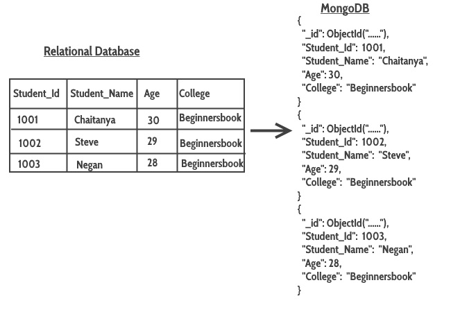
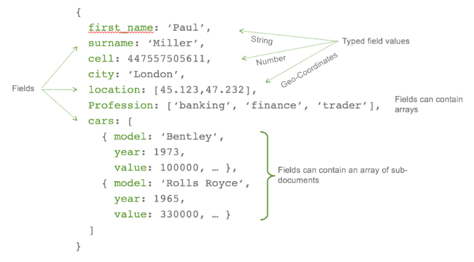
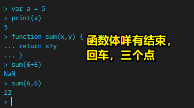

# 05-MongoDB

## ★MongoDB 安装

- <http://www.mongodb.com/>
- 环境变量 bin
- 命令 mongod
- 新建：`C://data/db`

1）前置知识

了解一个网站、app、微信小程序等，是由前端+后端+数据库组成的！

2）什么叫关系型数据库？

类似于 excel 表格 -> 有行有列 -> 一行即是一条数据，一列即是一个字段

我们通过 SQL 语句来 CRUD 数据库

3）非关系型数据库——MongoDB

1、是什么？

基于分布式的文件存储的数据库，是一个数据库，但它相当于是一个文件存储

简单来说，它是 nosql，即没有 sql 语句的数据库

总之，使用它，就不需要我们去学习 sql 语句了

引入官网的话：

> MongoDB（来自于英文单词“Humongous”，中文含义为“庞大”）是可以应用于各种规模的企业、各个行业以及各类应用程序的开源数据库。

4）适用场景

- MongoDB：基于文件、存储空间比较大
- 如果很多表之间需要级联、关联查询这样，是不适合用 MongoDB 的，而是使用关系型数据库
- 如果是频繁的读写操作，MongoDB 相对来说，性能会更高一些
- MongoDB 不支持事务操作，所以频繁读写，没有多关联，那就用 MongoDB

5）啥叫事务？

事务具有原子性，即要么全做，要么全不做，如果中间失败的话，那么就会回滚回去

6）如何安装 MongoDB？

1、安装

[下载](https://www.mongodb.com/download-center/community)：


安装：

1. 双击运行下载下来的文件
2. 不用自定义目录，当然，你也可以自定义目录（路径千万不要用中文），除非你是高级用户
3. 然后一直下一步，下一步就好了
4. 注意，"Install MongoDB Compass" 不要勾选，否则可能要很长时间（好几个小时）都一直在执行安装。MongoDB Compass，它是一个图形界面管理工具，所以你可以自行下载一个图形界面管理工具，如 [Robo 3T - Free, open-source MongoDB GUI (formerly Robomongo)](https://robomongo.org/)

2、配置环境变量

> win10：直接在本地搜索「环境变量」就好了

系统属性 -> 高级 -> 环境变量 -> 系统变量 -> Path -> 编辑 -> 新建：


确定 -> …… -> 退出系统属性

3、创建数据库文件的存放位置

如果你的项目是在 G 盘的，那么你就在该目录下创建 `G:\data\db`，然后定位到项目，打开终端，输入指令 `mongod`，回车，如这样：


出现以下信息，即说明数据库是安装成功的：


数据库是个服务，默认运行在 27017 这个端口上边去！

另一种检测方式：


## ★MongoDB里的那些概念

1）关系型数据库 vs MongoDB


> Fields (key and value pairs) are stored in document, documents are stored in collection and collections are stored in database.
> 
> 键值对 -> `{}` -> `{键值对}` -> Collection -> database
> 
> 字段（多个字段，列） -> 对象（多条数据，行） -> 数组（多张表） -> 数据库（多个数据库） -> MongoDB（非关系型数据库，一个像是系统之类的东西）

2）Rows (一行数据、一条数据) vs Documents (一个文件、一条记录)


3）Table vs Collection



- columns <=> key-value pairs（JSON format）
- rows  <=> documents
- MongoDB自动为每个document插入一个字段：unique `_id`(12-byte field) field -> 这是每个文档的主键「primary key」
- MongoDB很酷的地方：支持 dynamic schema -> one document of a collection can have 4 fields while the other document has only 3 fields -> 而这一点，在关系型数据库中是不可能的 -> 我的理解是假如在一个集合中，有两个对象，如A和B，A有5个字段，而B可以有1个、2个、3个等等，而关系型数据库则是让用户事先自定义好一张表到底有多少个字段，然后每行数据都有那么几个字段，不会出现「第一行比第二行多了3个字段」这样的这种情况

➹：[Mapping Relational Databases to MongoDB](https://beginnersbook.com/2017/09/mapping-relational-databases-to-mongodb/)

> 这是让我感到惊为天人的教程

4）关于字段的详细描述



➹：[Getting Started with Python and MongoDB — SitePoint](https://www.sitepoint.com/getting-started-with-python-and-mongodb/)


## ★常用命令 1

- mongo
- 变量 var
- 函数 function
- 输出 print
- 显示数据库 show dbs
- 进入/创建 数据库 use shop
- 显示集合 show collections
- 显示当前数据库 db

1）如何使用 MongoDB？（part1）

正常的数据库都会有 CRUD，同理，MongoDB 也是如此，而这节课，也主要是讲如何在 MongoDB 里边 CRUD……之后的课程里边会讲到如何用代码把前端、后端的 koa、MongoDB 整合起来

1、`mongo`：进入 MongoDB shell


> 注意，一定要先启动MongoDB服务，不然你进入的shell是咩有 `>`的，就如上图所示

2、var、print、function



在关系型数据库里边，数据库如excel表格一样，有行有列，每一张表都是数据库的表，而在MongoDB里边，不叫数据库的表，而是集合。

关系型数据库：每一行数据，就是数据行

MongoDB：每一行数据，相当于是一个文件，而其里边的数据格式非常像json格式，当然，这不是json，而是bson

3、show dbs

展示所有数据库，目前有：

``` js
> show dbs
admin   0.000GB
config  0.000GB
local   0.000GB
```

4、use xxx

``` js
> use tangxt
switched to db tangxt
```

> show dbs，可以看到没有tangxt这个数据库，如果有，那么就直接进入，如果没有，那就会创建tangxt这个数据库，然后进入

再次`show dbs`一下：

``` js
> show dbs
admin   0.000GB
config  0.000GB
local   0.000GB
```

没看到刚才新创建的数据库，那么为啥会没看见呢？——因为现在tangxt这个数据库，还是空的哈！只要不是空的，就能看见了！

5、db

查看当前杵在哪个数据库，类似pwd（当前在哪个目录下）

``` js
> db  
tangxt
```

查看tangxt这个数据库里边有哪些表，关系型数据库叫表，而非关系型，则是叫集合，所以正确地说法是「tangxt这个数据库里边有哪些集合」

6、show collections

collection -> 相当于是关系型数据库里边的tables

``` js
> show collections
> 
```

啥也没打印，那么为啥会这样呢？——因为tangxt这个数据库是空的呀！

所以，我们得往里边插入数据哈！

## ★常用命令 2

- 插入 `db.user.insert({"name":"weichuang"})`
- 查询 `db.user.find()`
- 查询 `db.user.findOne()`
- 修改 `db.user.update({查询},{修改})`
- 删除 `db.user.remove(条件)`
- 删除集合 `db.user.drop()`
- 删除数据库 `db.dropDatabase()`

- 加载 js 文件 `load('./xx.js')`

1）如何使用MongoDB？（part2）

1、`db.user.insert({"name":"weichuang"})`

- db -> 固定语法
- user -> 集合名字，相当于是表名

> 不需要创建user表即可直接插入数据，总之，同 `use tangxt`一样，咩有就自动创建之

``` js
> db.user.insert({"name":"xiaoming"})
WriteResult({ "nInserted" : 1 })
```

> 插入一条数据库

查看我们是否插入数据成功，所以我们需要查询user这个表，嗯，应该说是这个集合

2、`db.user.find()`

``` js
> db.user.find()
{ "_id" : ObjectId("5e5a7f9308e0f4e3a1ed778b"), "name" : "xiaoming" }
```

> `_id`是MongoDB自动生成的唯一的一个值，可不是我们自己写入生成的！ -> 可以认为是关系型数据库的主键 -> 唯一的值

再插入一条数据，并且查询：

``` js
> db.user.insert({"name":"xiaohong"})
WriteResult({ "nInserted" : 1 })
> db.user.find()
{ "_id" : ObjectId("5e5a7f9308e0f4e3a1ed778b"), "name" : "xiaoming" }
{ "_id" : ObjectId("5e5a80d608e0f4e3a1ed778c"), "name" : "xiaohong" }
```

此时查询得到了2条数据，可见，`db.user.find()`是查询user这张表所有的数据！

3、`db.user.findOne()`

``` js
> db.user.findOne()
{ "_id" : ObjectId("5e5a7f9308e0f4e3a1ed778b"), "name" : "xiaoming" } 
```

返回user这张表的第一条数据！

话说，我不想要第一条数据了，即「xiaoming」这条数据

4、`db.user.remove(条件)`

- 需要跟查询条件，如name叫「xiaoming」的数据

``` js
> db.user.remove({"name":"xiaoming"})
WriteResult({ "nRemoved" : 1 })
> db.user.find()
{ "_id" : ObjectId("5e5a80d608e0f4e3a1ed778c"), "name" : "xiaohong" } 
```

话说，user这张表里边的数据，我都不想要了，即我想清空这张表里边的数据

5、`db.user.drop()`

``` js
> db.user.drop()
true
> db.user.find()
> 
```

`db.user.find()` -> 啥也没输出，所以这张user表目前是空空如也哈！

话说，我想删除数据库跑路


6、`db.dropDatabase()`

- db一下，定位目前是在哪个数据库

``` js
> use test
switched to db test
> db
test
> db.dropDatabase()
{ "ok" : 1 }
```

2）加载js文件？

啥意思？——就是我们之前在MongoDB shell里边写的代码，可以写在js文件里，然后再通过MongoDB shell来load js文件了，注意，假如你在mongodb目录打开的shell，那么你就基于这个目录找js文件

做法如下：

``` js
// mongodb/1.js
var userName = "xiaoming";
var time = Date.parse(new Date());
var data = {
  username: userName,
  registerTime: time
};
// 连接tangxt这个数据库
var db = connect("tangxt");
db.user.insert(data);
print("insert success");
```

效果：

``` js
> db
tangxt
> load('./1.js')
connecting to: mongodb://127.0.0.1:27017/tangxt
Implicit session: session { "id" : UUID("……") }
MongoDB server version: 4.2.3
insert success
true
> db.user.find()
{ "_id" : ObjectId("5e5b65b4d082afd9b3c459e9"), "username" : "xiaoming", "registerTime" : 1583048116000 }
> 
```

## ★数据更新 update

- 数据更新
- `$set`
- `$unset`
- `upsert`
- `multi`
- `$push`
- `$addToSet`
- `$each`
- `$set`
- `findAndModify`

1）为啥要单独拎出来讲更新？

插入、删除 -> 是很简单的 -> 即insert和remove

而更新、查询、「当数据很大的时候，如何检索则」是这节课的重点内容

2）如何更新tangxt这个数据库？

1、先让数据库有点数据？

1. 清空tangxt数据库里的user集合的数据，`db.user.drop()`
2. 检查是否已经清空了：`db.user.find()`
3. js -> 造3条数据
4. 插入数据，一个数据就写一个对象，一对数据就写一个数组
5. MongoDB是NOSQL的，CRUD操作，就是用js的语法来搞！并没有用到所谓的SQL语法！

2、更新数据库？

update(条件,改成啥样的数据) -> 改写一个字段的数据，会把其它字段都给覆盖掉，即原先假如有5个字段的，现在你只改一个，结果数据只剩下一个你改的那个字段了 -> 我们想要的就是还是5个字段，只是某个字段的数据被改掉了

解决方案：

方案一：

目前tangxt数据库，有这样一条数据：

``` js
var user1 = {
    name: "xxx",
    age: 26,
    hobby: ['敲代码', '篮球', '喝茶'],
    pc: {
        brand: 'apple',
        price: 10000
    }
};
```

我们要修改这条数据，得这样来：

``` js
db.user.update({name:'xxx'},{{
  name: 'xxx',
  age: 18,
  hobby: ['白嫖'],
  pc: {
    brand: 'apple',
    price: 9999
  }
}})
```

虽然可以实现我们的需求，但是这并不好呀！因为我咋知道user1它有哪些字段和值呢？况且，假如有100个字段，岂不是GG呢？

所以，对于这样的更新需求，我们该咋办呢？

这个时候，修饰符出马了！

3、$set

方案二：

修改指定的值：

``` js
db.user.update({name:'xxx'},{
  $set: {
    age: 21
  }
})
```

> 很多人把MongoDB看作是k-v数据库
> 
> k-v的v，在shell里边操作，假如v是字符串，那么单双引号都是可以的，而k可加引号，可不加，反正就跟写js一样

假如，xxx工作忒忙了，所以他现在咩有爱好了，因此我们要删掉爱好，所以，这该咋办呢？

删掉数据，其实也可以说是更新数据

4、$unset

``` js
db.user.update({name:'xxx'},{
  $unset: {
    'hobby': ''
  }
})
```

结果，hobby这个字段从user1里边消失了，即由原先的4个字段，变为3个字段了！

总之，`$unset`的作用是删除一个key值，以及对于的value值

5、upsert？

长得有点奇怪，像是update和insert的结合体

它的作用：如果当前找不到这个字段值，那就插入新的字段值，否则，就更新字段所对应的值

我想要update数据，那update谁的数据呢？——update那个叫「xxx」的数据，如xxx工作繁忙，经常熬夜加班，导致看起来像是50岁的样子，所以更新它的age为了50

``` js
db.user.update({name:'xxx'},{$set:{age:50}},{upsert:true})
```

由于xxx它存在age这个字段，所以会直接更新age的值，反之，如果没有age这个字段，那就会插入age这个值

所以，`upsert = field ? update : insert`

6、multi？

user1没有hobby，而user2和user3有爱好

> 不写查询条件，即直接 `{}`，表示查询所有数据
> 
> 不加true，即为false，那么这只对第一条数据加，而不是所有

作用：用来统一所有用户都有某个字段，如所有的男性用户，都有性别为男这样的k-v，如所有的程序员，都有敲代码这一hobby

``` js
// 如果这样做，所有user的hobby都为`['敲代码']`
db.user.update({},{$set:{hobby:['敲代码']}},{multi:true})

// 如果这样做，所有user的hobby字段都为空数组`[]`,如果是空字符串，则会让hobby字段消失
db.user.update({},{$set:{hobby:[]}},{multi:true})
```

7、$push？

作用：可以给一个字段为数组这样的数据，增加一个数据，如hobby是数组，其中有一个元素为 `'敲代码'`，那么我们push一个 `'吃鸡'`，就会变成这样 `hobby:['敲代码','吃鸡']`

``` js
db.user.update({name:'xxx'},{$push:{hobby:'吃鸡'}})
```

8、$addToSet？

作用：同 `$push`，只是它会检查数组是否存在相同的元素，如果要add的元素，已经在数组里边存在了，那么就不会追加进去，而 `$push`则不管三七二十一直接把数据push进数组里边去了

可看做这样：`isExistElement ? noModified : push`

``` js
db.user.update({name:'xxx'},{$addToSet:{hobby:'睡觉'}})
```

> 类似数组去重！

9、$each？

作用：把一堆的东西，然后一个个地插入到为数组的字段里边去

``` js
var newHobby = ['吃鸡','叫人起床','学习']
db.user.update({name:'xxx'},{$addToSet:{hobby:{$each:newHobby}}})
```

10、$set？

作用：修改某个字段的值

代码敲多了，眼睛不行了，所以不敲代码了，改行健身

``` js
db.user.update({name:'xxx'},{
  $set: {
    'hobby.0':'健身'
  }
})
```

> 可以直接修改，数组字段里边的某个元素值

11、findAndModify？

啥意思？——顾名思义，查找并且修改

话说，它的作用是啥？

它是应答式的，有返回结果，然后可以取到值 -> 在js文件进行

而之前的update是非应答式的 -> 只告知 `WriteResult()`结果，而这些数据无法用于我们编程 -> 在MongoDB shell进行

``` js
var modify = {
    findAndModify: 'user',
    query: {name: 'xxx'},
    update: {$set: {age: 29}},
    new: true
};

var result = db.runCommand(modify);
// 可不能用console.log()
printjson(result);
```

返回结果的结构：

``` js
{
  lastErrorObject:{
    n:1,
    updatedExisting: true
  },
  value: {
    // ……字段
  }
}
```

如果我们是 `new:true`，那么返回的value值，就是更新后的结果数据，否则就是更新前的旧数据

我们根据 `updatedExisting`这个值的true or false来做 `if……else……`编程，即如果更新成功就……，否在……

findAndModify 与 update的区别：

- findAndModify：应答式的，即数据是否更新成功，得告诉我一声
- update：非应答式的，即无法在代码里边知道数据是否更新成功，当然，你可以在MongoDB shell里边，肉眼观察是否更新成功

## ★数据查询 find

- `$lt`、`$gt`、`$lte`、`$gte`
- `$in`
- `$or` `$and` `$not`
- 数组 `$all` `$in` `$size`
- 分页 limit skip sort
- js forEach


## ★索引

- 生成随机数据
- `db.collection.ensureIndex({username:1})`
- `db.collection.getIndexes()`
- `db.collection.dropIndex({username:1})`
