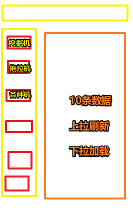

# 08-商品分类功能

## ★需求

数据 -> 来自 -> MongoDB数据库

所以我们要造数据！

之前，搞了个用户集合，现在得搞个产品集合！

## ★开搞

1）数据怎么造？

在data目录下新建这两个文件：

1. product.json -> 使用python爬取过来的数据（各种农机的信息，如图片、价格、名字等）
2. type.json -> 写死的数据（各种类型的农机，如id1是挖掘机，id2是拖拉机……） -> 为啥会有这个文件？因为老师没有爬取到产品的类型信息 -> 这意味着会有两个集合——Product和Type集合

正常情况下，一个电商网站的数据，是通过卖家、管理员来上传数据所得到的！

2）如何通过node读取json数据，然后写到MongoDB里边去？

> 以后做其它的电商网站，也可以用这种方式来做

回到后端Node.js 代码

搞个Model -> model/Product.js（有过之前创建模型的经验，那么接下来要做的功夫就很简单了）：

搞个Controller -> controller/product.js -> 读取data下的product.json和type.json

这个过程 -> 需要用到fs模块

同样，我们还得搞个type.js以及Type.js

最后都得配置路由！

3）前端界面部分

1、关于布局？

了解过bootstrap都知道，要分成12列栅格

而现在，一般都是分成24列了，因为24列更灵活哈！

关于栅格：就是把页面的宽分成几份，如你是两栏布局的话，那么每栏就是占据12个格子，同理，3栏则是一栏8个格子

2、何时去获取数据？

当加载分类组件之后，就去发送axios请求读取数据！

3、后端处理请求

处理type/getTypes请求

