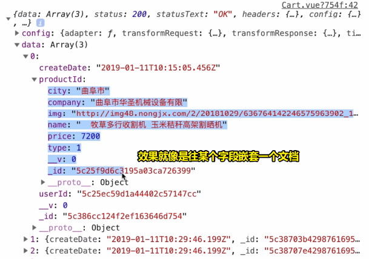
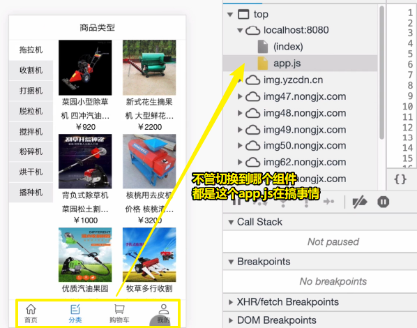
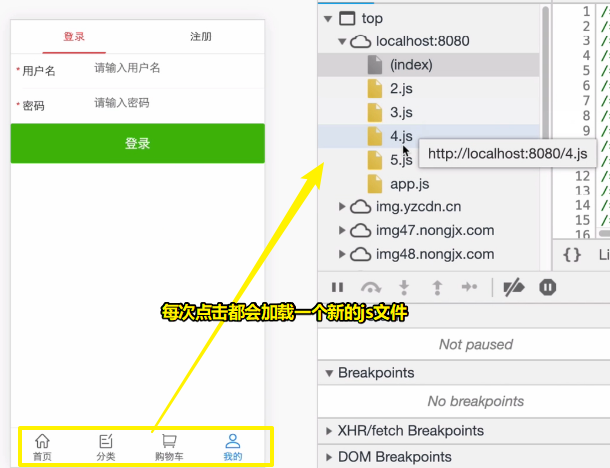
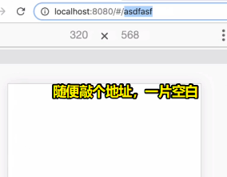
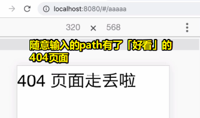
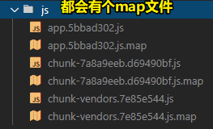
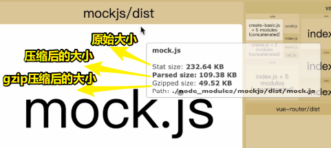

# 10-购物车功能及优化

## ★购物车

- van-card
- computed计算总价
- 需要判断用户是否登录
- 多集合查询

### <mark>1）加入购物车 -> 插入数据到数据库</mark>

用户 -> 点击 -> 加入购物车 -> 判断用户是否登录 -> 如果已经登录 -> 发送ajax请求 -> 插入数据库

需要创建一个「购物车集合」

发送请求要带的数据 -> 产品唯一标识，即产品id -> 用户信息，即表明是哪个用户在把产品添加到购物车里边去，或者说谁要买这个产品

后端自己约定的code -> 可以写成成功就`code:1`，失败就`code:2` -> 但是为了跟http状态码相匹配所以就成功为`code:200`，失败为`code:500`

> 购买数量 -> 如果用户已经在购物车里边添加了商品，那么我们得判断一下这个商品是否已经在购物车里边了 -> 如果已经在了，那么添加一下就加个1， -> 这意味着我们的购物车集合都有个表示「购买数量」的字段 -> 反之，如果没有，那就直接插入数据即可！

### <mark>2）购物车页面之判断登录</mark>

> 产品经理决定着程序交互是怎样的，如用户切换到购物车前端代码会做什么

切换到「购物车」这个tab -> 判断用户是否登录，因为只有用户登录了，才能查看「购物车」详情 -> 所以假如用户没有登录，那么就得跳到登录页面，然后登录成功后再返回「购物车」这个页面

### <mark>3）关于 `...mapState(['userInfo'])`的理解？</mark>


测试代码：

``` js
var z = {name: 'frank'}
function mapState(arr) {
    return {a:1,b:z}
}

var o = {
    ...mapState()
}

console.log(o) //{a: 1, b: {name:'frank'}}
console.log(o.b.name) //"frank"
o.b.name = 'yuan' 
// 可见这是浅拷贝
console.log(z) //{name: "yuan"}
```

猜测mapState的代码 -> 通过mapState这个API可以拿到在vuex里边定义的state，在这里拿到了`userInfo`这个状态 -> mapState的返回值是一个对象 -> 意味着computed的最终代码是这样的：

``` js
{
  computed: {
    userInfo: function() {
      // 在vuex里边存储的userInfo值
      return 'xxx'
    }
  }
}
```

这样一来，在当前这个子组件里边我们就可以用 `this.userInfo`来读取全局状态里边的userInfo值！

➹：[Vuex 通俗版教程 - YeaseonZhang](https://yeaseonzhang.github.io/2017/03/16/Vuex-%E9%80%9A%E4%BF%97%E7%89%88/)

➹：[vuex的state,mapState,...mapState对象展开符详解-不忘初心，方得始终-51CTO博客](https://blog.51cto.com/9161018/2322492)

➹：[Vuex中mapState的用法_JavaScript_老虎帅呆了的博客-CSDN博客](https://blog.csdn.net/fanhu6816/article/details/80389173)

➹：[vuex的辅助函数mapState前面的那三个点--对象展开运算符_JavaScript_喵大嗷的博客-CSDN博客](https://blog.csdn.net/connie_0217/article/details/78874698)

➹：[计算属性和侦听器 — Vue.js](https://cn.vuejs.org/v2/guide/computed.html)

### <mark>4）购物车页面编写 -> vant的卡片组件</mark>

### <mark>5）如何做多集合查询？</mark>

购物车集合存储的是「产品id」、「用户id」、「产品创建日期」等字段 -> 没有产品标题、产品图片、产品价格等字段

而用户一进入都购物车页面，所关心的是产品标题等字段

所以，我们需要根据购物车里边的「产品id」来查询来自products集合的产品详情

做法 -> 多集合查询（虽然这个业务逻辑简单，但涉及到的知识点也是挺多的，而多集合查询对于其他数据库来说也是大同小异）

原来的Cart集合：

``` js
// Cart.js
const cartSchema = new Schema({
    ID: ObjectId,
    productId: ObjectId,
    userId: ObjectId,
    createDate: { type: Date, default: Date.now() }
});
```

多集合查询：

``` js
// Cart.js
const cartSchema = new Schema({
    ID: ObjectId,
    productId: {
        type: ObjectId,
        ref: 'Product' // 指向联合查询的model
    },
    userId: ObjectId,
    createDate: { type: Date, default: Date.now() }
});
```

> ref -> 关联之意，表示把「Product」关联到 Cart集合的「productId」这个字段

注意，ref的值由来：

``` js
// Product.js
mongoose.model('Product', productSchema);
```

使用：

``` js
// cart.js
router.get('/getCart', async (ctx) => {
    const Cart = mongoose.model('Cart');
    await Cart.find({ userId: ctx.query.userId }).populate('productId').exec().then(res => {
        ctx.body = res;
    });
});
```

> populate -> 居住在、填充、移民

效果如下：



相较于之前，productId它只是一个字符串值，而现在则是一个对象值！ -> 显然带有更多的数据 -> 数据多了，就好编程了！如把需要的数据展示到界面上

多集合查询是很常见的 -> 如一个学生集合它上了哪些课则需要通过课程id来关联课程集合

### <mark>6）computed和watched的区别？</mark>

- computed：计算属性依赖其它属性，当其它属性发生变化的时候，计算属性也要发生变化，总之，如果一个数据依赖于其他数据，那么把这个数据设计为computed的 -> 有缓存  
- watched：如果你需要在某个数据变化时做一些事情，使用watch来观察这个数据变化

➹：[面试题： Vue中的 computed 和 watch的区别 - 掘金](https://juejin.im/post/5c9990d6f265da60ea146d21)

### <mark>7）如何计算购物车里边的总金额？</mark>

使用reduce方法

### <mark>8）如何任意删除数组里边的元素？</mark>

使用splice方法

## ★优化

> 打包的过程中需要优化啥？以及如何优化打包完的这个包？

- 刷新页面，footerBar默认选中
- 缓存路由组件
- 路由组件懒加载
- 错误页面处理404
- UI库按需加载
- 打包文件分析
- gzip

> 52:36

### <mark>1）刷新页面，footerBar默认选中</mark>

bug：假如页面地址是 `#category` -> 页面刷新 -> 那么footerBar默认选中的应该是 `分类` 这个Tab才对 -> 结果选中的是 `首页` 这个Tab，即默认的第一个

为啥会出现这个bug呢？

因为每次刷新页面，就得重新加载一次footBar组件，而footBar组件的`active`值默认是0，而这意味着每次刷新页面重新加载footBar组件都会默认选中第一个Tab

如何解决？

使用localStorage来解决 -> 保存最后一次选中的数据 -> 每次加载就获取数据，然后重新对active赋值

> 咩有localStorage之前，存储数据的方式用的是Cookie之类的

``` html
<van-tabbar v-model="active" @change="change"></van-tabbar>
```

``` js
export default {
  data() {
    return {
      active: 0
    };
  },
  // footBar这个组件一渲染就得去取数据
  created(){
    // 存储的值都是字符串，所以需要转成数值
    this.active = parseInt(localStorage.getItem('active'));
  },
  methods: {
    change(active){
      localStorage.setItem('active', active);
    }
  }
};
```

tab切换了会触发change事件 -> 该事件会传的第一个参数是切换所对应的tab索引

### <mark>2）缓存路由组件</mark>

bug：

在「分类」组件里边 -> 选择「烘干机」会发送ajax请求 -> 此时你在切换到其它组件，如「我的」组件 -> 你再切回「分类」组件 -> 此时默认会选择第一个「拖拉机」，而且又会发送一次ajax请求

我们想要什么？

切回来之后，保持原样，而且不需要再次发送请求一样数据的ajax请求 -> 简单来说，就是要缓存组件，避免加载多次同一个组件，以此来减少性能消耗

我们知道所有的组件都是在这个匿名的`router-view`标签渲染的：

``` html
<template>
  <div id="app">
    <router-view></router-view>
    <router-view name="footer-bar"></router-view>
  </div>
</template>
```

做法，加个keep-alive标签包裹住就好了：

``` html
<template>
  <div id="app">
    <keep-alive>
      <router-view></router-view>
    </keep-alive>
    <router-view name="footer-bar"></router-view>
  </div>
</template>
```

效果：在keep-alive标签旗下所有渲染的组件都会被缓存掉！

升级做法 -> 我们想指定某个组件缓存，而不是keep-alive旗下的所有组件都被缓存 -> 何时使用？ -> 当项目很复杂有很多组件的时候

配置router.js，添加一个meta属性就好了：

``` js
{
  path: '/',
  name: 'home',
  // component: Home
  components: {
    default: Home,
    'footer-bar': FooterBar
  },
  meta: {
    keepAlive: true
  }
}
```

你要缓存哪个组件，那么你就配置一下meta的keepAlive属性为`true`，否则你就配置为`false`，当然你也可以不进行配置，因为这也是false哈！

不过只是这样做了，是不生效的，你还得配置一下`App.vue`：

``` js
<template>
  <div id="app">
    <keep-alive>
      // 如果为true，那么这个组件就会被缓存掉，而这意味着，
      // 你切换到另外一个组件，再切换回来是保持原样的
      <router-view v-if="$route.meta.keepAlive"></router-view>
    </keep-alive>
    
    // 如果为false，那么这个组件就不会被缓存掉 -> 每次加载这个组件都会重新加载
    <router-view v-if="!$route.meta.keepAlive"></router-view>
    <router-view name="footer-bar"></router-view>
  </div>
</template>
```

测试：

profile组件不设置缓存，其余路由组件设置缓存 -> 在profile页面里边，从默认的「登录」tab切换到「注册」tab -> 焦点来到FootBar组件，切换到「首页」组件，再切回到「profile」组件 -> 你会发现，此时的tab是默认的「登录」tab -> 如果你为「profile」组件也设置了缓存，那么还是原来的「注册」tab

所谓的缓存 -> 看上去页面就是保持页面原样，不管你是切换了组件，然后再切换回来

### <mark>3）路由组件懒加载</mark>

是什么？

用户输入url来到首页 -> 加载首页组件、分类组件、用户组件…… -> 而这显然会让首屏渲染很慢 -> 毕竟有时候用户来到首页之后，找到了它所需要的，就不会去看其它组件页面了

因此，我们想只「加载路由组件」

测试：

没有进行路由组件懒加载 -> 打开页面 -> 打开network -> 你会发现每次切换tab都是同一个app.js（所有的js代码都被打包到这里边了）

``` js
// route.js
import Home from './views/Home.vue'
import Category from './views/Category.vue'
import Cart from './views/Cart.vue'
import Profile from './views/Profile.vue'
```



使用路由组件懒加载：

``` js
// router.js
let Home = ()=> import('./views/Home.vue');
let Category = ()=> import('./views/Category.vue');
let Cart = ()=> import('./views/Cart.vue');
let Profile = ()=> import('./views/Profile.vue');
```



本质 -> 函数用到了，才会调用函数，即请求组件

在这里函数的本质是延迟执行……

➹：[路由懒加载 - Vue Router](https://router.vuejs.org/zh/guide/advanced/lazy-loading.html#%E6%8A%8A%E7%BB%84%E4%BB%B6%E6%8C%89%E7%BB%84%E5%88%86%E5%9D%97)

➹：[vue路由懒加载原理解析--第一部分 - 掘金](https://juejin.im/post/5de7fa926fb9a0165f48e6e3)

### <mark>4）错误页面处理404</mark>



我们随意输入的这个path，根本就咩有写相应的路由

而这给出的空白页面，一点都不好看，大多数的网站都会整个好看的「404」页面出来

做法：

写个404页面，这里为了简单起见，就简单写点意思意思一下就好了：

``` html
<!-- views/Error.vue -->
<template>
  <h1>404 页面走丢啦</h1>
</template>
```

配置一下路由：

``` js
// router.js
import Error from './views/Error.vue'
{
  path: '*',
  component: Error
}
```

> 不知道用户输了个啥，就用个 `*`来表示

效果：



### <mark>5）UI库按需加载</mark>

之前已经说了，即：

- 完全引入 -> 打包出来的文件体积很大，优点想用啥组件就用啥组件
- 按需引入 -> 打包出来的文件体积相对来说较小，缺点需要自一个个动手去引入

### <mark>6）打包文件分析</mark>

什么叫打包文件分析？ -> 简单来说，就是打包一下 -> 分析打包出来的东西

默认情况下打包出来的js文件，都会多一个map.js文件，该文件很大，用于debug我们的js代码，毕竟我们打包出来的js文件都是加密过的，即混淆过，为了保证文件体积更小，都把长的变量名改成为「一个字母」的变量名了



然而，我们部署「生产」代码到服务器上是不需要上传这个map.js文件的

那么这该如何解决呢？

查看vuecli3官网，你需要搞个全局配置的核心文件：

``` js
module.exports = {
  productionSourceMap: false
}
```

何时用这个配置？ -> 项目调试好，可以上线后，就用这个配置，不然报错是没有错误提示的

➹：[配置参考 - Vue CLI](https://cli.vuejs.org/zh/config/#productionsourcemap)

配置项目自动在浏览器中打开，以及自定义端口号？

``` js
module.exports = {
  productionSourceMap: false,
  devServer: {
    open: true
  }
}
```

这些配置都是基于webpack的，所以懂webpack的配置对于你使用vuecli3这个脚手架工具是很重要的！

总之，一切配置看官网 -> 你想要啥？那么你就去看官网看看需要配置啥，才有你想要的效果……

言归正传，所谓的打包分析就是直观看看「打包出来的东西有多大，然后我该如何对其进行有针对性的优化」？

做法（build时加个参数`--report`）：

``` js
// package.json

{
  "scripts": {
    "build": "vue-cli-service build --report"
  }
}
```

效果：

在dist目录下多了一个`report.html`，该页面展示了：

- 项目打包完以后所有的文件以及该文件所对应的体积大小（矩形越大所表示的文件体积越大，越需要进行优化）

拿mock.js这个文件来看：



正常情况下，我们都是用parsed size这种压缩的，不过相较于gzip的压缩率来说，这压缩就有点不够看了！

回过头来说，是优化：

mock.js这个文件200多k，但项目上线后是不需要它的，所以我们不需打包它，所以我们可以注释掉它：

``` js
// main.js
// import '@/mock/mock.js';
```

这样一来，原文件体积就从1M多变成800多k了

除了mock.js看起来很大以外，还有swiper.js

我们只用了「vue-awesome-swiper」的一个简单的轮播模块，并咩有用到它所有的功能，所以我们可以用「vue-swiper」，这个相对来说，要小很多

➹：[weilao/vue-swiper: Swiper component For Vue 1.0.](https://github.com/weilao/vue-swiper)

### <mark>7）gizp</mark>

它是干嘛的？ -> 是一种压缩方式

被它压缩过的文件，才是最小的文件体积，不过，它需要配合服务器使用才行，注意这不是「后端代码」，而是「后端服务器」

准备工作：


使用gzip的意义：


如何才能成为一个gzip？

gzip文件的结尾是`.gz`的

需要安装一个包：

``` bash
yarn add -D compression-webpack-plugin
```

配置：

``` js
// vue.config.js
const path = require('path');
const CompressionPlugin = require('compression-webpack-plugin');

module.exports = {
  productionSourceMap: false,
  devServer: {
    open: true
  },
  configureWebpack: config => {
    if(process.env.NODE_ENV === 'production'){
      return {
        plugins: [
          new CompressionPlugin({
            test: /\.js$|\.html$|\.css$/,
            threshold: 10240,
            deleteOriginalAssets: false
          })
        ]
      }
    }
  }
}
```

> test：正则匹配哪些文件需要被gzip:
> 
> threshold：低于10kb就不gzip压缩；
> 
> deleteOriginalAssets：是否保留要被gzip压缩的源文件

有源文件的效果：


> 如果你配置了Nginx，那么浏览器发送请求时，拿到的是gz文件而不是js文件

没有源文件的效果，即 `deleteOriginalAssets` 的值为 `true` :


以上是对gzip的前端配置

要使gzip真正起作用，还得配置服务器，一般都是用Nginx（高性能，可以并发支持50000个用户……不够，配集群……）

你可以搜索一下「Nginx对gzip支持的配置」 -> 很简单，几行代码即可配置好！

> 这些优化知识是很重要的！

## ★总结

- 十次直播课就此结束了，虽然项目里边涉及到的业务逻辑是很简单的，但里边涉及到了很多的知识点。做完这个项目后，对于做其它商城网站来说都是大同小异的，总之，多敲几遍老师的这个项目就好了！


