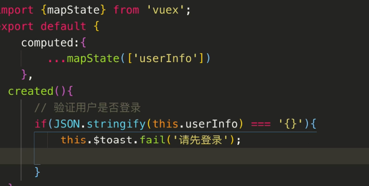

# 10-购物车功能及优化

## ★购物车

- van-card
- computed计算总价
- 需要判断用户是否登录
- 多集合查询

1）加入购物车 -> 插入数据到数据库

用户 -> 点击 -> 加入购物车 -> 判断用户是否登录 -> 如果已经登录 -> 发送ajax请求 -> 插入数据库

需要创建一个「购物车集合」

发送请求要带的数据 -> 产品唯一标识，即产品id -> 用户信息，即表明是哪个用户在把产品添加到购物车里边去，或者说谁要买这个产品

后端自己约定的code -> 可以写成成功就`code:1`，失败就`code:2` -> 但是为了跟http状态码相匹配所以就成功为`code:200`，失败为`code:500`

> 购买数量 -> 如果用户已经在购物车里边添加了商品，那么我们得判断一下这个商品是否已经在购物车里边了 -> 如果已经在了，那么添加一下就加个1， -> 这意味着我们的购物车集合都有个表示「购买数量」的字段 -> 反之，如果没有，那就直接插入数据即可！

2）购物车页面之判断登录

> 产品经理决定着程序交互是怎样的，如用户切换到购物车前端代码会做什么

切换到「购物车」这个tab -> 判断用户是否登录，因为只有用户登录了，才能查看「购物车」详情 -> 所以假如用户没有登录，那么就得跳到登录页面，然后登录成功后再返回「购物车」这个页面

3）关于 `...mapState(['userInfo'])`的理解？



测试代码：

``` js
var z = {name: 'frank'}
function mapState(arr) {
    return {a:1,b:z}
}

var o = {
    ...mapState()
}

console.log(o) //{a: 1, b: {name:'frank'}}
console.log(o.b.name) //"frank"
o.b.name = 'yuan' 
// 可见这是浅拷贝
console.log(z) //{name: "yuan"}
```

猜测mapState的代码 -> 通过mapState这个API可以拿到在vuex里边定义的state，在这里拿到了`userInfo`这个状态 -> mapState的返回值是一个对象 -> 意味着computed的最终代码是这样的：

``` js
{
  computed: {
    userInfo: function() {
      // 在vuex里边存储的userInfo值
      return 'xxx'
    }
  }
}
```

这样一来，在当前这个子组件里边我们就可以用 `this.userInfo`来读取全局状态里边的userInfo值！

➹：[Vuex 通俗版教程 - YeaseonZhang](https://yeaseonzhang.github.io/2017/03/16/Vuex-%E9%80%9A%E4%BF%97%E7%89%88/)

➹：[vuex的state,mapState,...mapState对象展开符详解-不忘初心，方得始终-51CTO博客](https://blog.51cto.com/9161018/2322492)

➹：[Vuex中mapState的用法_JavaScript_老虎帅呆了的博客-CSDN博客](https://blog.csdn.net/fanhu6816/article/details/80389173)

➹：[vuex的辅助函数mapState前面的那三个点--对象展开运算符_JavaScript_喵大嗷的博客-CSDN博客](https://blog.csdn.net/connie_0217/article/details/78874698)

➹：[计算属性和侦听器 — Vue.js](https://cn.vuejs.org/v2/guide/computed.html)

4）购物车页面编写 -> vant的卡片组件


## ★优化

> 打包的过程中需要优化啥？以及如何优化打包完的这个包？

- 刷新页面，footerBar默认选中
- 缓存路由组件
- 路由组件懒加载
- 错误页面处理404
- UI库按需加载
- 打包文件分析
- gzip
